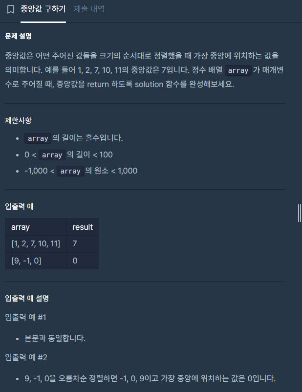

기초 알고리즘 문제인데, c++을 몇 년만에 다시 공부하면서 quick sort 함수 구현을 해보게 되어서 글로 남긴다.

## 1. 접근

(1) 정렬한다.<br/>
(2) array[len/2]를 리턴한다.

## 2. 소스코드
```c++
#include <string>
#include <vector>

using namespace std;

void quick_sort(vector<int>& array, int left, int right) {
    if (left >= right) return;
    int org_left = left;
    int org_right = right;
    int pivot = array[left++];

    //pivot - left ------ right

    while (left <= right) {
        while (left < array.size() && array[left] <= pivot) left++;
        while (right >= left && array[right] >= pivot) right--;

        //swap
        if (left < right) {
            int tmp = array[left];
            array[left] = array[right];
            array[right] = tmp;
        }

    }
    int tmp = array[right];
    array[right] = array[org_left];
    array[org_left] = tmp;


    quick_sort(array, org_left, right - 1);
    quick_sort(array, right + 1, org_right);
}
void sort(vector<int>& array) {
    if (array.size() <= 0) return;

    quick_sort(array, 0, array.size() - 1);


}

// array_len은 배열 array의 길이입니다.

int solution(vector<int> array) {
    sort(array);
    return array[array.size() / 2];
}
```


> **\<퀵 정렬 알고리즘\>**
<br/>첫번째 값을 pivot으로 잡아서, left는 +1씩 증가시켜가며 pivot보다 큰 값을 만날 때까지 이동하고, right는 -1씩 감소시켜가며 pivot보다 작은 값을 만날 때까지 이동한다.
<br/>left와 right가 둘다 정지했다면, left < right라는 가정 하에 두 자리의 값을 swap한다.
<br/>
<br/>그리고 다시 위의 동작을 반복한다.
<br/>위의 동작은 left가 right를 넘어설 때까지 반복된다.
<br/>
<br/>left가 right를 넘어섰다면 right의 자리와 pivot의 자리의 값을 교체한다.

