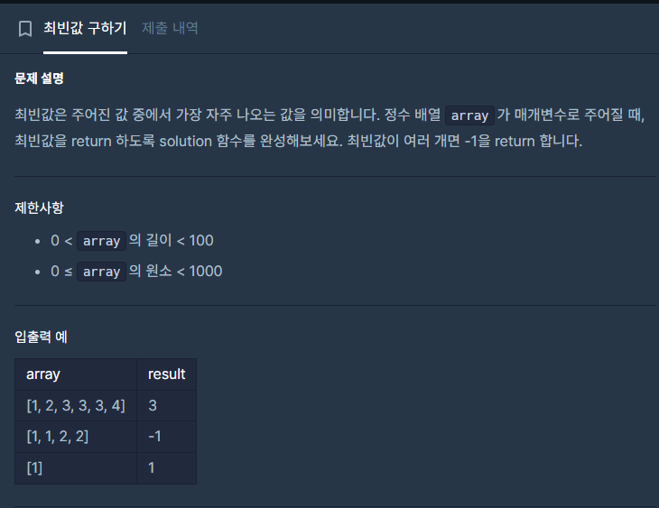

좀 찝찝하게 풀었다. \
추후에 더 깔끔한 코드를 고민해봐야함.

```c++
#include <string>
#include <vector>
#include <map>

using namespace std;

int solution(vector<int> array) {


    map<int, int> map;

    for(auto it=array.begin(); it!=array.end(); it++){
        if(map.find(*it) == map.end())
            map.insert({*it, 1});
        else
            map[*it]++;
    }

    int max_key = -1;
    int max = -1;
    for(auto it=map.begin(); it!=map.end(); it++){
        if(it->second > max){
            max_key = it->first;
            max = it->second;
        }
    }
    for(auto it=map.begin(); it!=map.end(); it++){
        if(it->first != max_key && it->second == max) return -1;
    }
    return max_key;
}
```