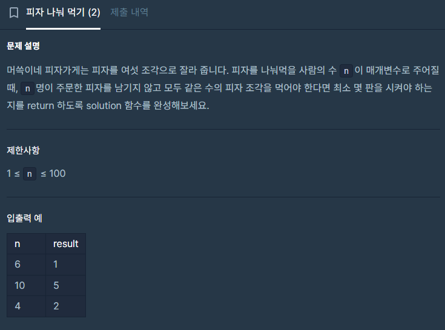

## 접근

n과 6의 최소공배수를 구하는 문제다.
마지막에 6으로 나눠주는 것도 잊지 말자.

먼저 유클리드 호제법으로 최대공약수를 구해준다. \
큰 수 A와 작은 수 B가 있을 때, A와 B의 GCD(최대공약수)는 B와 A%B의 GCD와 같다. \
이를 재귀법으로 반복하여 작은 수가 0이 되었을 때 큰 수의 값이 GCD다.


코드로 표현하면 다음과 같다.

```c++
int gcd(int b, int s){
    if(s==0) return b;
    return gcd(s, b%s);
}
```
\
\
이렇게 얻은 최대공약수로 최소공배수를 구해준다.

> 최소공배수*최대공약수 = A\*B

이 공식을 외워두자.
실전에서 쓸 일은 없겠지만 코테에선 자주 쓰일 것 같으니까...

위 문제에선 (최소공배수/6) 을 구해야 하니 ((A*B / 최대공약수) / 6)을 구해주면 되겠다.


## 소스코드

```c++
#include <string>
#include <vector>

using namespace std;

int gcd(int b, int s){
    if(s==0) return b;
    return gcd(s, b%s);
}
int solution(int n) {
    // 6과 n의 최소공배수
    int _gcd = (n<6? gcd(6, n) : gcd(n, 6));
    return ((6*n)/_gcd)/6;

}
```