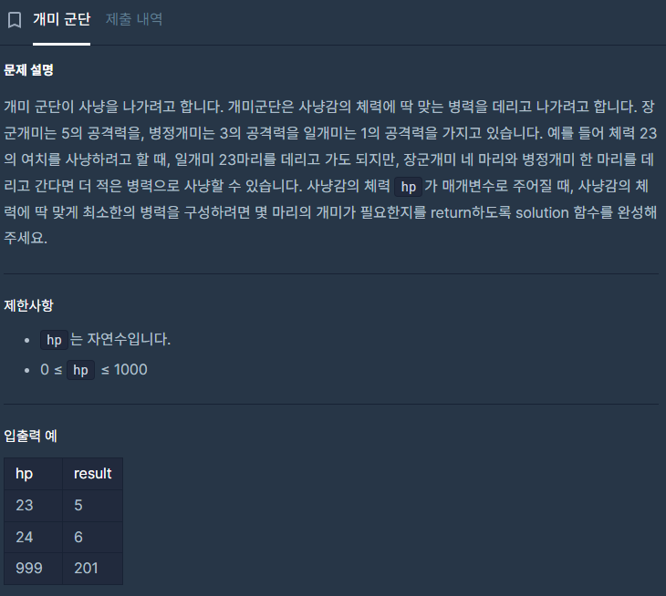

## 접근

배낭 문제와 비슷하게 느껴져서 DP 알고리즘이라고 생각했다.
굳이 DP로 안 풀어도 됐을 것 같지만...


DP를 써야 하는지 탐욕 알고리즘을 써야 하는지 헷갈렸는데,
찾아보니 탐욕 알고리즘은 부분최적이 전체에 대하여 최적이어야 한다고 하더라. \
가령 병정개미의 공격력이 {5, 3, 1}이 아니라 {6, 3, 1}이었다면 탐욕 알고리즘을 써도 됐던 거다. \
항상 더 큰 수가 작은 수의 배수라면, 선택할 수 있는 가장 큰 값을 매번 선택해도 최적해가 나온다.

하지만 이 문제는 {5, 3, 1}로 주어졌기 때문에 DP를 쓰기로 했다.

먼저 특정 hp일 때 필요한 최소 개미 수를 저장하기 위해 배열 dp를 선언하고,

```c++
int dp[1001]; // n<=1000
```

확실하게 최적인 값을 먼저 채워준다.

적의 체력이 x일 때 가능한 최소 개미 수가 dp[x]에 저장되는 것이다.

5일 땐 공격력 5인 개미 1마리 \
3일 땐 공격력 3인 개미 1마리 \
1일 땐 공격력 1인 개미 1마리

나머지 값은 0으로 채워둔다.
전역변수라 자동으로 0으로 채워지는 걸로 알지만, 초기화는 그냥 항상 하는 게 나은 것 같아서 초기화 했다.

여기서 HP는 문제에서 주어지는 적의 체력이다.

```c++
for(int i=0; i<=HP; i++){
    dp[i] = 0;
}

dp[1] = 1;
dp[3] = 1;
dp[5] = 1;

```

이제 값을 앞에서부터 채우며 부분결과를 저장한다. \
hp가 1일 때부터 주어진 값 HP일 때까지.
공격력이 1일 때부터 n일 때까지.

dp[hp+1]에 저장할 값은 dp[hp]+dp[1] 이다. 하지만 만약 dp[hp-atk] + dp[atk]가 더 작다면 이 값을 저장한다.

풀어서 말하자면, hp+1의 체력을 가진 적을 죽이기 위해 현재 dp[hp] + 1마리의 개미가 필요한데,
hp-atk의 적을 죽이기 위해 필요한 개미의 수 + atk의 적을 죽이기 위한 개미의 수를 더한 것이 더 작은 수라면,
값을 치환해 저장한다.

또한 값이 0이라면 아직 해가 저장되지 않은 것이므로 무조건 dp[hp-1]+dp[1]을 저장한다.


여기서, DP는 값을 앞에서 채울 때와 뒤에서 채울 때로 나뉜다. \
(1) 앞에서부터 채울 때는 각 아이템이 여러 번 사용될 수 있을 때. 이때는 앞 번호 아이템이 이미 쓰인 상태의 값을 또 사용하게 된다. \
(2) 뒤에서부터 채울 때는 각 아이템의 사용 횟수가 정해져있을 때이다. 이때는 가장 큰 값의 아이템부터 쓰여지므로 앞 번호 아이템에서 뒷 번호 아이템에서 쓴 값을 사용할 수 없다.

이 문제에선 각 개미들을 무제한으로 사용할 수 있기 때문에 앞에서부터 값을 채우는 게 맞다.

## 소스코드

```c++
#include <string>
#include <vector>

using namespace std;

int dp[1001];

int solution(int HP) {

    for(int i=0; i<=HP; i++){
        dp[i] = 0;
    }
    dp[1] = 1;
    dp[3] = 1;
    dp[5] = 1;

    for(int hp=1; hp<=HP; hp++){
        for(int atk=1; atk<=hp; atk++){
            if(dp[hp] == 0){
                dp[hp] = dp[hp-1] + dp[1];
            }
            else if((dp[hp]+1 > dp[hp-atk] + dp[atk])){
                dp[hp] = dp[hp-atk]+dp[atk];
            }
        }
    }
    return dp[HP];
}
```