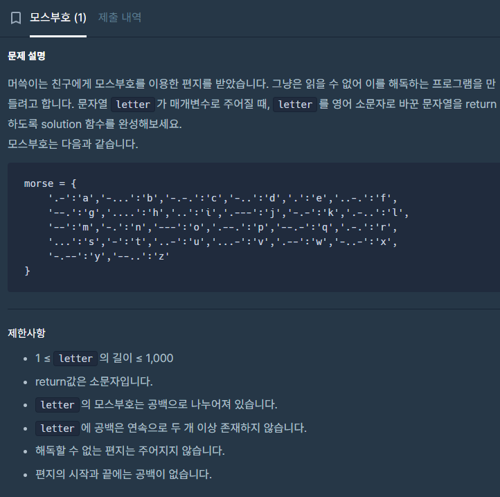

## 접근
접근법이 필요한 문제는 아니다.\
그냥 string에서 공백을 기준으로 문자를 끊어서 가져오는 법과 key-value 쌍으로 값을 저장하는 자료구조를 쓸 줄 알면 되는 문제다.\
c++의 string 관련 문법을 몰라서 검색해서 풀었다.

\
\
여기서 쓰이는 문법은
1. string.find(문자, 시작pos)
2. string.substr(시작pos, 길이)
3. map.find(key값)

세가지 정도다.

string.find와 string.substr은 둘다 size_t라는 자료형을 반환하는데, 들어있는 값은 int와 같다. 다만 find함수는 원하는 값을 찾지 못했을 때 string::npos라는 값을 반환한다. \
그래서 if(pos != string::npos) 라는 조건문으로 find함수가 성공했는지 여부를 검색할 수 있다. \
주의할 점은, string::npos에 1을 더하면 0이 된다는 점이다. 실제 값은 -1이 들어가는듯.

\
\
먼저 letter에서 공백을 기준으로 끊은 문자열의 시작과 종료 커서를 저장하기 위해 c_begin과 c_end를 선언한다.\
예를 들어 "abcd efg" 의 경우, 처음 c_begin은 0을, c_end는 공백 위치인 4를 저장하게 될 것이다.\
\
이후 c_begin+1을 해주고 c_end는 다음 공백을 찾는 식으로 반복하며 모스부호를 찾고, map에서 해당 모스부호를 키값으로 얻은 알파벳을 answer에 더해주면 된다.\
마지막엔 c_end가 npos가 되어 바로 벗어나게 되므로 while문이 아니라 do-while문을 써주었다.\
do-while문을 쓰면 마지막 모스부호를 순회하는 차례에 c_end가 npos가 되어도 조건을 검사하기 전에 본문이 먼저 실행되므로 마지막 모스부호까지 문제없이 answer에 담을 수 있다.

## 소스코드

```c++
#include <string>
#include <vector>
#include <map>
using namespace std;

string solution(string letter) {
    map<string, char> morse_map = {
        {".-", 'a'},
        {"-...", 'b'},
        {"-.-.", 'c'},
        {"-..", 'd'},
        {".", 'e'},
        {"..-.", 'f'},
        {"--.", 'g'},
        {"....", 'h'},
        {"..", 'i'},
        {".---", 'j'},
        {"-.-", 'k'},
        {".-..", 'l'},
        {"--", 'm'},
        {"-.", 'n'},
        {"---", 'o'},
        {".--.", 'p'},
        {"--.-", 'q'},
        {".-.", 'r'},
        {"...", 's'},
        {"-", 't'},
        {"..-", 'u'},
        {"...-", 'v'},
        {".--", 'w'},
        {"-..-", 'x'},
        {"-.--", 'y'},
        {"--..", 'z'}
    };

    string answer = "";
    size_t c_begin = 0;
    size_t c_end = -1;
    do{
        c_begin = c_end+1;
        c_end = letter.find(' ', c_begin);

        answer += morse_map.find(letter.substr(c_begin, c_end-c_begin))->second;
    }
    while(c_end != string::npos);

    return answer;
}
```