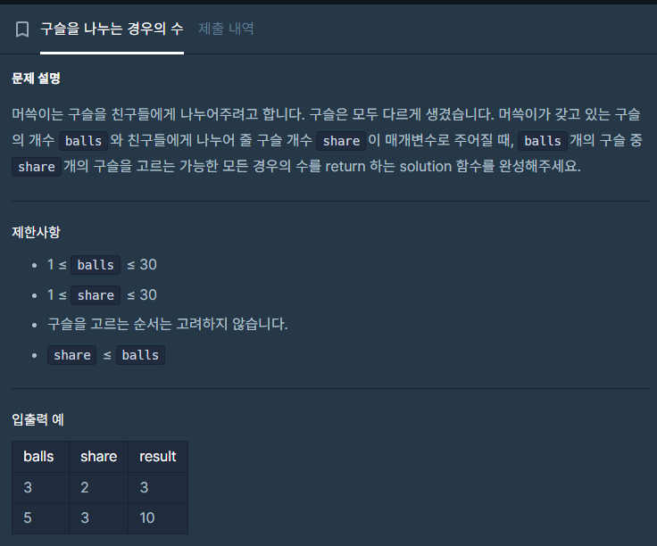
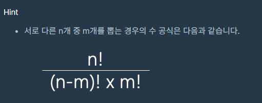

## 접근
큰 수를 다뤄야 하는 문제.

공식도 문제에 나와있고, 팩토리얼을 구현하기만 하면 되는데 \
문제는 int에 안 담긴다. \
\
쓸 수 있는 가장 큰 자료형인 unsigned long long을 쓰고, \
계산 내내 result값을 최대한 줄이면서 변수에 저장해야 한다. \
\
\
nCm을 구현하는 문제인데,
```c++
unsigned long long result = 1;
for(int i=0; i<m; i++){
    result = result*(n-i)/(i+1);

}
```
반드시 이렇게 구현해야 하더라.
```c++
result *= (n-i)/(i+1);
```
로 풀면 실패한다. \
result를 분자로 하여 나눈 뒤에 result에 덮어씌워야 자릿수를 초과하지 않기 때문이다.




이 공식에서 n!을 (n-m)!으로 먼저 나눠버린다고 치면,\
**분자는 n * n-1 * n-2 * ... * n-m+1** \
**분모는 m * m-1 * m-2 * ... * 1** \
이 된다. \
\
같은 변수로 묶을 수 있는 값을 빼면 \
**분자는 n - (0부터 m-1까지)** \
**분모는 (1부터 m까지)** \
\
i를 0부터 m+1까지 for문을 돌리면

```c++
for(int i=0; i<m; i++){
    result = result * (n-i)/(i+1)
}
```
이 되는 것.

여기서 최대 의문은 매 식마다 정확히 정수로 나뉘어떨어진다는 걸 어떻게 보장하는가?였는데, 이 의문은 각 순회가 nCi라고 생각하면 답이 나왔다. \
aCb의 결과는 항상 정수로 나뉘어 떨어진다. \
저 식에서 m이 1일 때, 2일 때, 3일 때, 그리고 m일 때까지 모든 값은 각각 nCm을 의미하는데, 그 말은 항상 정수로 나뉘어 떨어진다는 것이다. \
그래서 매 순회의 result는 정수임이 보장된다.

이 문제는 그냥 외워두는 게 마음 편할 것 같다.
> nCm은 for문을 0부터 m-1까지 돌리며 result = result*(n-i)/(i+1)로 구할 수 있다.


## 소스코드

```c++
#include <string>
#include <vector>

using namespace std;

unsigned long long func(int n, int m){

    unsigned long long result = 1;
    for(int i=0; i<m; i++){
        result = result*(n-i)/(i+1);

    }
    // n n-1 n-2 ... n-m+1  // 0~m-1
    // m m-1 m-2 ... 1      // 1~m


    return result;
}
unsigned long long solution(int balls, int share) {
    //balls개 중 share개를 선택하는 경우의 수
    // balls! / share!(balls-share)!

    unsigned long long answer = func(balls, share);
    return answer;
}
```