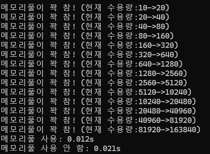
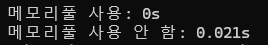

이전에 cs를 공부할 때 구현했던 메모리풀을 다시 봤는데,\
이상하게 구현돼있는 부분이 좀 있어서 고쳤다. \
\
다 사용한 뒤 일괄 해제를 위해 Memory 라는 struct를 선언해 연결리스트로 관리하고 address를 참조시킨다.
```c++
struct Memory {
    void* address;
    Memory* next;
};
```
새로 풀을 할당하면 이 구조체로 된 연결리스트에 추가한다.

먼저 메인이 되는 MemoryPool의 헤더파일과 소스파일.

```c++
//MemoryPool.h
#pragma once
struct Memory {
    void* address;
    Memory* next;
};


class MemoryPool {
private:
    const int MAX_POOL_SIZE = 200000000; //최대 200MB까지만 늘어남
    int _poolSize;
    int _blockSize;
    void* _freeBlockPtr;
    Memory* _HEAD;
public:
    MemoryPool(int poolSize, int blockSize);
    void* allocate(int size);
    void deallocate(void* ptr);
    int capacity();
    void increasePool();
    void clear();
};
```

```c++
//MemoryPool.cpp
#include <list>
#include <iostream>
#include "MemoryPool.h"

//고정된 크기(T와 같은)의 메모리풀을 가짐.
//메모리의 첫번째 4바이트엔 다음 주소가 저장됨. 없으면 0.

MemoryPool::MemoryPool(int poolSize, int blockSize) {
    _poolSize = poolSize;
    _blockSize = blockSize;

    _freeBlockPtr = malloc(_poolSize);
    //가장 앞 4바이트를 주소로 다루어 다음 free block을 가리키게 초기화함.
    void** cursor = reinterpret_cast<void**>(_freeBlockPtr);
    for (int i = 0; i < capacity() - 1; i++) {
        (*cursor) = reinterpret_cast<void*>(cursor + _blockSize / sizeof(void*));
        cursor += _blockSize / sizeof(void*);
    }

    //마지막 포인터는 NULL
    (*cursor) = NULL;

    //할당받은 공간을 HEAD에 연결해줌.
    Memory* memory = (Memory*)malloc(sizeof(Memory));
    memory->address = _freeBlockPtr;
    memory->next = NULL;
    _HEAD = memory;
}
int MemoryPool::capacity() {
    return  _poolSize / _blockSize;
}
void MemoryPool::increasePool() {
    void* newPool = malloc(_poolSize);

    //가장 앞 4바이트를 주소로 다루어 다음 free block을 가리키게 초기화함.
    void** cursor = reinterpret_cast<void**>(newPool);
    for (int i = 0; i < capacity() - 1; i++) {
        (*cursor) = reinterpret_cast<void*>(cursor + _blockSize / sizeof(void*));
        cursor += _blockSize / sizeof(void*);
    }

    //마지막 블록은 닫아놓고
    //현재 freeBlockPtr이 새 풀의 맨 앞을 가리키도록 재설정.
    (*cursor) = NULL;
    _freeBlockPtr = newPool;

    //풀 사이즈 두 배로 늘림
    _poolSize += _poolSize;

    //새로 할당한 풀의 다음 주소로 현재 HEAD를 이어줌.
    //현재 HEAD는 새로 할당한 풀로 재설정.
    Memory* memory = (Memory*)malloc(sizeof(Memory));
    memory->address = newPool;
    memory->next = _HEAD;
    _HEAD = memory;
}
void* MemoryPool::allocate(int size) {
    //블록 크기보다 큰 사이즈를 할당받으려 하면 예외 반환
    if (size > _blockSize) {
        std::cout << "메모리풀 블록 사이즈보다 큰 영역이 요구됨!\n";
        throw std::bad_alloc();
    }

    //남아있는 freeblock이 없으면 두 배로 확장
    void** ptr = reinterpret_cast<void**>(_freeBlockPtr);
    if (ptr == NULL){
        if (MAX_POOL_SIZE >= 2 * _poolSize) {
            std::cout << "메모리풀이 꽉 참! (현재 수용량:" << capacity() << "->";
            increasePool();
            std::cout << capacity() << ")\n";
            ptr = reinterpret_cast<void**>(_freeBlockPtr);
        }
        else {
            std::cout << "메모리풀의 수용량이 한계에 다다랐습니다!\n";
            throw std::bad_alloc();
        }
    }

    //std::cout << "메모리 할당! (" << ptr << ")\n";
    //freeBlockPtr을 리턴하고 freeBlockSize만큼 포인터 이동.
    _freeBlockPtr = (*ptr);
    return reinterpret_cast<void*>(ptr);
}
void MemoryPool::deallocate(void* ptr) {
    //ptr은 반환할 위치를 가리키고 있음.
    //현재 _freeBlockPtr 주소를 nextFreeBlock으로 저장.
    //_freeBlockPtr이 ptr과 같은 걸 가리키도록 하고, _freeBlockPtr이 가리키는 값의 첫 4바이트에 nextFreeBlock을 저장
    if (ptr == NULL) return;

    void* nextFreeBlock = _freeBlockPtr;
    _freeBlockPtr = ptr;
    *(reinterpret_cast<void**>(_freeBlockPtr)) = nextFreeBlock;

}
void MemoryPool::clear() {
    //추가로 할당받은 공간을 전부 삭제
    while (_HEAD != NULL) {
        free(_HEAD->address);
        _HEAD = _HEAD->next;
    }
    _freeBlockPtr = NULL;
}
```

여기서 void\* 타입 포인터의 커서를 reinterprete<void**>로 다루는 걸 볼 수 있는데, void로 할당받은 힙 공간을 가리키는 포인터가 void\*일 때, 이 힙 공간에 임시로 다음 블록의 첫 주소를 저장해놓으려 하기 때문이다. 힙 공간은 실제로는 void타입(타입이 없는)이지만 이곳에 임시로 주소를 저장하려면 void**타입의 커서로 역참조를 해야 한다.\
void\*타입을 역참조해서 값을 저장하려 하면 void타입 공간에 값을 쓰게 되므로 문제가 생긴다.\
\
프로그램 코드는 다음과 같다.

```c++
#include <iostream>
#include <list>
#include "MemoryPool.h"
#include <time.h>
//#define WORST_CASE //계속 할당만 함.
//#define NORMAL_CASE //루프를 반으로 나누어 할당과 해제를 반복.
#define BEST_CASE   //할당과 해제를 반복.
constexpr int MAX_LOOP = 1000000;
constexpr int POOL_SIZE = 1000;

constexpr int BLOCK_SIZE = 100;
constexpr int ALLOC_SIZE = 100;
void usePool() {
    MemoryPool pool(POOL_SIZE, BLOCK_SIZE);
#ifdef WORST_CASE
    void** memoryList = (void**)malloc(sizeof(void*) * MAX_LOOP);
    for (int i = 0; i < MAX_LOOP; i++) {
        void* memory = pool.allocate(ALLOC_SIZE);
        *(memoryList + i) = memory;

    }
    for (int i = 0; i < MAX_LOOP; i++) {
        pool.deallocate(*(memoryList + i));
    }
#elif defined( NORMAL_CASE )
    void** memoryList = (void**)malloc(sizeof(void*) * MAX_LOOP / 2);
    for (int i = 0; i < MAX_LOOP / 2; i++) {
        void* memory = pool.allocate(ALLOC_SIZE);
        *(memoryList + i) = memory;

    }
    for (int i = 0; i < MAX_LOOP / 2; i++) {
        pool.deallocate(*(memoryList + i));
    }
    for (int i = 0; i < MAX_LOOP / 2; i++) {
        void* memory = pool.allocate(ALLOC_SIZE);
        *(memoryList + i) = memory;

    }
    for (int i = 0; i < MAX_LOOP / 2; i++) {
        pool.deallocate(*(memoryList + i));
    }
#elif define( BEST_CASE )
    for (int i = 0; i < MAX_LOOP; i++) {
        void* memory = pool.allocate(ALLOC_SIZE);
        pool.deallocate(memory);
    }
#endif

    pool.clear();
}
void notUsePool() {
    for (int i = 0; i < MAX_LOOP; i++) {
        void* memory = (void*)malloc(ALLOC_SIZE);
        free(memory);
    }
}
int main() {
    clock_t start, end;
    double time;
    try {
        start = clock();
        usePool();
        end = clock();
        time = static_cast<double>(end - start) / 1000;
        std::cout << "메모리풀 사용: " << time << "s\n";


        start = clock();
        notUsePool();
        end = clock();
        time = static_cast<double>(end - start) / 1000;
        std::cout << "메모리풀 사용 안 함: " << time << "s";
    }
    catch (std::bad_alloc) {
        std::cout << "Error: bad_alloc\n";

    }
}


```

MAX_LOOP를 바꿔가며 테스트해본 결과, 최소 10만 번 이상의 할당이 일어나야 유의미한 속도차이가 느껴지기 시작했다.\
\
한 번에 100byte를 할당하며, 블록 사이즈도 100byte이다.\
시작 풀 사이즈는 1000byte.\
\
10만 번을 쌩으로 malloc을 호출하는 것 vs 미리 할당된 공간에서 주소만 넘겨주는 것.(만약 풀이 꽉 차면 두 배로 늘린다.)\
\
그 중에서도 (1) 계속 할당만 하다가 한 번에 해제하는 경우


두 배 정도의 속도 차이를 보인다. 풀 공간의 재사용성이 떨어져 확장하는 데에 걸리는 시간이 있기 때문.\
\
\
반면 (2) 할당과 해제를 반복하는 경우,


한 번 확장된 공간을 계속 재사용하므로 풀의 확장이 한 번도 일어나지 않고 최대효율을 보이게 된다.
