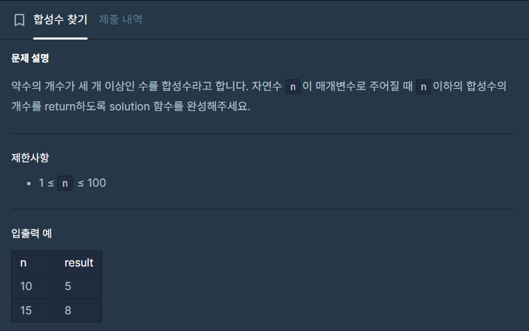

## 접근
약수의 개수가 세 개 이상인 수.\
소수 찾기 문제다.\
소수는 약수의 개수가 2개인 수이므로.. n에서 소수와 1(약수의 개수가 2개도 3개도 아닌 예외)을 제외한 수가 합성수가 된다. \
\
\
소수를 구하는 방법은 에라스토테네스의 체를 사용한다.
소수 구하는 문제에서 갖다쓸 수 있어서 외워두는 게 좋을 것 같다.

2부터 시작해서 2의 배수를 전부 지우고\
3부터 시작해서 3의 배수를 전부 지우고..\
이걸 반복하면 되는데, n까지 반복하는 게 아니라 i\*i<=n일 때까지 반복한다.\
\
2, 2\*2, 2\*3, 2\*4, ... 를 반복하고 나면
3, 3\*2 <-이걸 검사할 필요가 없다. 위에서 2\*3으로 이미 검사했기 때문. 3\*3부터 검사하면 된다.
그래서 i는 2부터 i\*i<=n일 때까지 순회하고,\
각 i에 대하여 i\*i부터 i의 배수를 검사하면 된다.\
이때 i가 소수가 아니라면 뒤의 값은 이미 앞선 순회에서 검사했다는 뜻이므로 넘어간다.\
\
코드로 정리하면 다음과 같다.\
(소수를 검사하는 코드만 떼어놓은 것.)

```c++
bool sosoo[101];

int solution(int n) {

    sosoo[1] = false;
    sosoo[2] = true;
    for(int i=3; i<101; i++){
        sosoo[i] = true;
    }

    for(int i=2; i*i<=n; i++){
        if(sosoo[i]){
            for(int j= i*i; j<=n; j+=i){
                sosoo[j] = false;
            }
        }
    }


}
```
기억할 것은\
(1) 시작 값이 소수가 아닌 값(확실히 검사한 값)은 뒤쪽 배수 검사를 생략해서 시간을 절약할 수 있다.\
(2) 소수인 값(다음 배수부터는 확실히 소수가 아닌 값)은 i\*2가 아니라 i\*i부터 순회함으로써 시간을 절약할 수 있다. 앞쪽 순회에서 i\*(i-1)까진 이미 검사가 끝났음을 보장하기 때문.

## 전체 소스코드

```c++
#include <string>
#include <vector>
using namespace std;


bool sosoo[101];

int solution(int n) {

    sosoo[1] = false; //소수도 아니고 합성수도 아님.
    sosoo[2] = true;  //소수
    for(int i=3; i<101; i++){
        sosoo[i] = true;
    }

    for(int i=2; i*i<=n; i++){
        if(sosoo[i]){
            for(int j= i*i; j<=n; j+=i){
                sosoo[j] = false;
            }
        }
    }

    int notSosooCnt = 0;
    for(int i=1; i<=n; i++){
        if(!sosoo[i])notSosooCnt++;
    }
    return notSosooCnt-1;


}
```