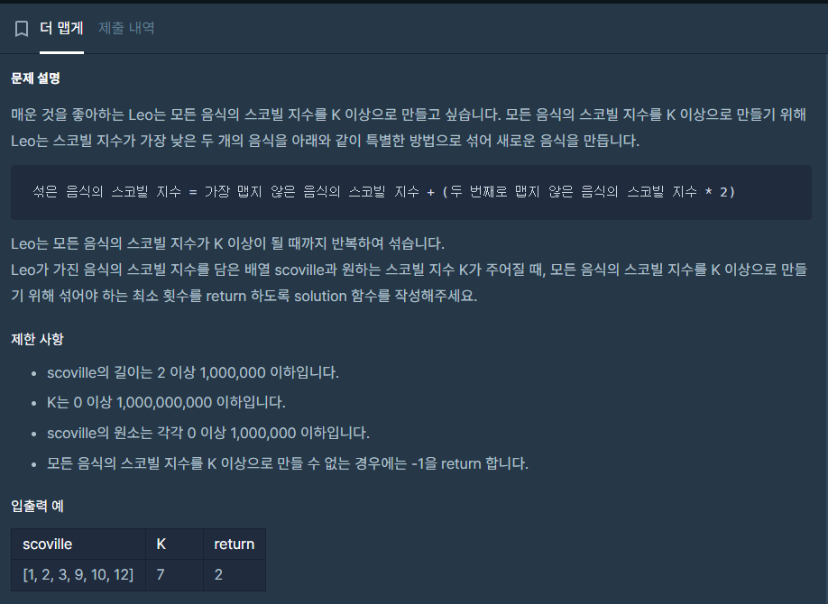

## 접근
처음엔 연결리스트로 구현했는데, 시간초과와 segmentation fault가 왕창 나면서 몇몇 테스트 케이스를 통과하지 못했다.

ai 피드백을 받아보니, 연결리스트는 삽입, 삭제, 탐색 시 O(n)의 시간복잡도를 가지므로 효율적이지 못하다는 설명을 들었다.
이 문제는 정렬을 유지하며 삽입 삭제를 해야하므로 삽입 삭제에 O(log n)의 시간복잡도, top에서 가져오는 데 O(1)의 시간복잡도를 갖는 우선순위 큐를 사용해야 한다고 한다.

C++에서의 우선순위 큐는 \<queue\> 라이브러리에 포함된 priority_queue로 이미 구현되어 있다.
\
\
다만 기본값이 "가장 큰 수가 top에 오도록" 정렬되는 것이기 때문에,\
(1) \<functional\>을 추가로 선언하고 priority_queue\<int, vector\<int\>, greator\<int\>\> 을 사용하거나 \
(2) 음수로 뒤집어 삽입해야 한다.

나는 단순하게 음수로 뒤집어 삽입한 다음 꺼낼 때마다 양수로 바꿔주도록 했다.
\
\
또한 큐에 남은 아이템이 최소 2개 이상이어야 섞을 수 있으므로 종료 조건에 큐의 사이즈와 가장 작은 스코빌의 값을 걸어놓는다. \
whlie문을 빠져나왔을 때 가장 작은 스코빌의 값을 검사하여 time을 반환할지 -1을 반환할지 결정한다.
\
\
전체 소스코드는 다음과 같다.

## 전체 소스코드

```c++
#include <string>
#include <vector>
#include <queue>
using namespace std;


int solution(vector<int> scoville, int K) {
    priority_queue<int> q;
    for(int i=0; i<scoville.size(); i++){
        q.push(-scoville[i]);
    }

    int time = 0;
    while(q.size()>1 && -q.top()<K){
        int t1 = -q.top();
        q.pop();
        int t2 = -q.top();
        q.pop();
        q.push(-(t1 + t2*2));
        time++;
    }

    if (-q.top() < K) return -1;

    return time;


}
```