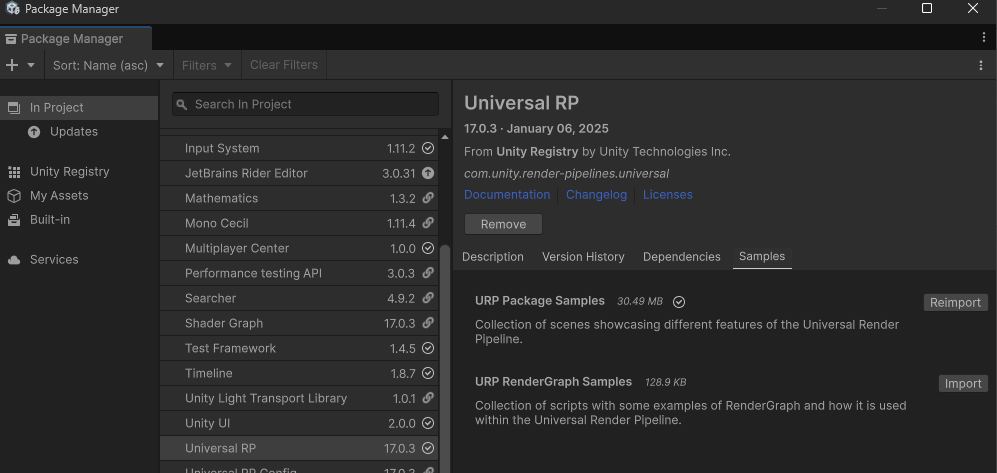
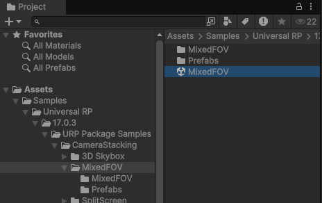
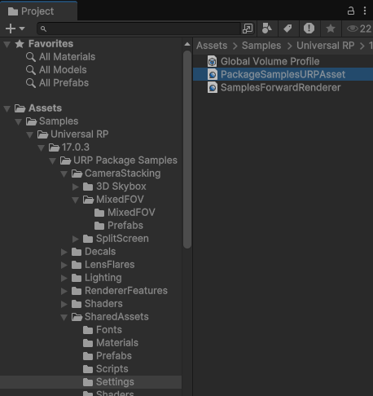
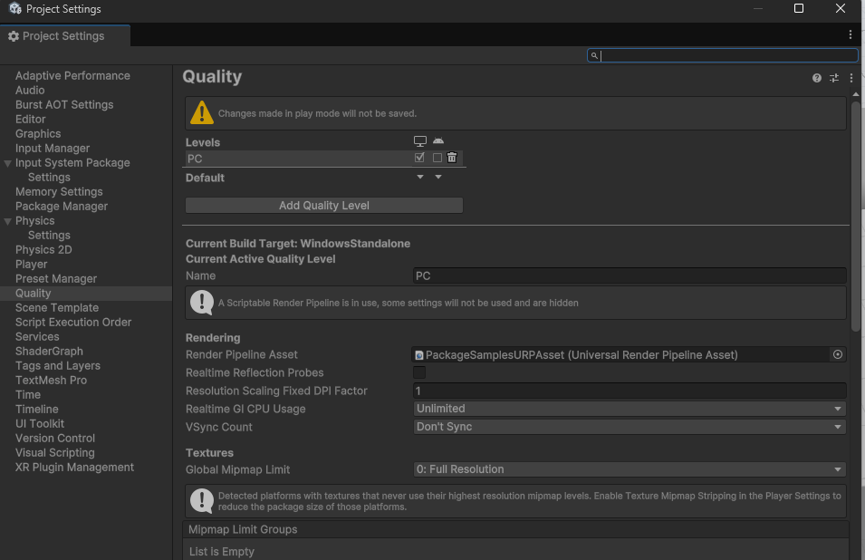
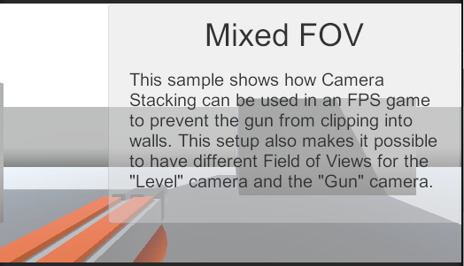
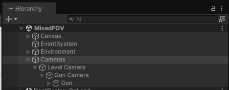
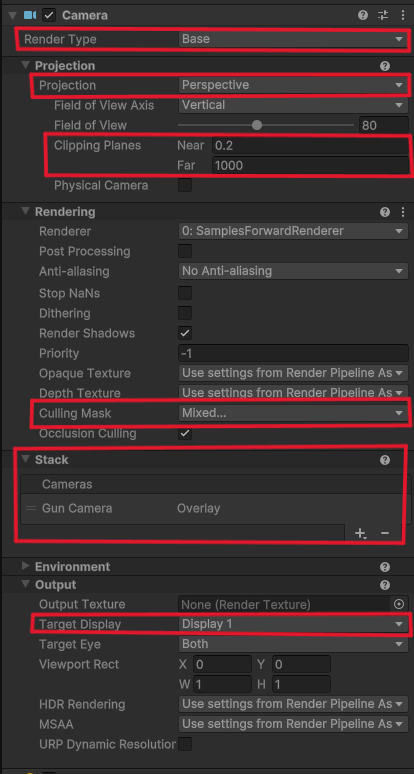
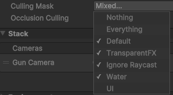
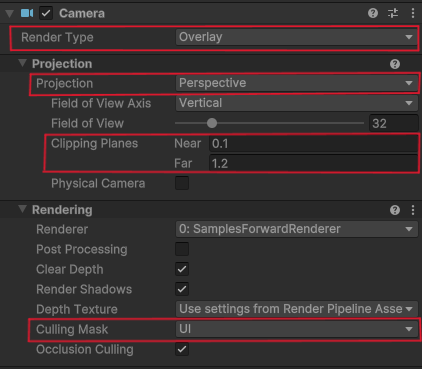

# URP(Universial Render Pipeline)에 대하여

<table style="table-layout: fixed; width: 100%; border: 1px solid gray;">
    <tr>
        <td style="word-wrap: break-word; word-break: break-word; white-space: normal; padding: 10px;"> <span style="font-weight:bold">유니버설 렌더 파이프라인(URP)</span>은 Unity에서 제작한 사전 빌드된 스크립터블 렌더 파이프라인입니다. URP는 아티스트 친화적 워크플로를 통해 모바일, 고사양 콘솔, PC 등 다양한 플랫폼에서 최적화된 그래픽스를 쉽고 빠르게 구현하도록 도와줍니다.</td>
    </tr>
</table>

먼저, 렌더 파이프라인이란 무엇인가.

화면상의 오브젝트들을 순서대로 유저 눈에 보이도록 그리는 일련의 절차를 말한다.

유니티에서 렌더 파이프라인은 Built-in Render Pipeline(BRP?)와 Universial Render Pipeline(URP)로 나눌 수 있다.
BRP는 유니티 2022 이전에 사용되던 렌더 파이프라인이고, URP는 새로 나온 렌더 파이프라인인 듯 하다.
과거에 유니티 개발을 했다면 그동안은 BRP를 사용한 것이라고 보면 될 것 같다.

익숙한 것을 선택하는 게 개발 속도에 도움이 될 테지만, BRP -\> URP로의 대체가 새로운 흐름이라면 대세에 따라야 하지 않을까.

구글에 비교분석을 검색해본 결과, 1인 개발에 사용할 거라면 큰 고민 없이 뉴페이스인 URP를 채택하면 될 것 같다. 장기적으로 볼 때 URP쪽이 계속해서 개발이 되고 유지보수가 이루어질 게 분명하기 때문이다.

한마디로 더 빠르고, 호환성이 좋고, 발전된 기술이 들어간 렌더 파이프라인이다. 다만 BRP는 오랜시간 개발한 만큼 지원되는 기능이 여러가지 있지만 URP엔 아직 구현되지 않거나 미지원 예정인 기능들이 좀 있다는 점을 고려해야 한다.

# URP 샘플 패키지 분석하기

처음 프로젝트를 생성할 때 URP 3D를 선택해 생성하면 기본적으로 필요한 도구들은 함께 설치된다.
하지만 아직 URP가 정확히 무엇이고, 이걸로 뭘 할 수 있는지 모른다...

그러니 공식 문서로 공부해보자.

[Unity 공식 문서: 샘플 패키지](https://docs.unity3d.com/kr/Packages/com.unity.render-pipelines.universal@15.0/manual/package-sample-urp-package-samples.html)

샘플 패키지를 직접 사용해보기 위해 Window > Package Manager에서 Universial RP의 Sample Package를 import해보았다.



## URP 샘플 패키지 사용해보기


### (1) Camera Stacking: Mixed field of view

첫번째 예제인 Mixed field of view 샘플 패키지를 사용해보자.


- 샘플 패키지 폴더 안에서 씬을 찾아서 선택하고


- Edit > Project Settings > Quality > Rendering 아래의 Render Pipeline Asset 항목에 샘플 URP Asset을 넣는다.
    <div style="display: flex; justify-content: space-between;">
    
    
    </div>


<div style="clear:both;"></div>

<br/>
<br/>
<table style="table-layout: fixed; width: 100%; border: 1px solid gray;">
    <tr>
         <th style="word-wrap: break-word; word-break: break-word; width: 100%;">Mixed field of view</th>
    </tr>
    <tr>
        <td style="word-wrap: break-word; word-break: break-word; white-space: normal; padding: 10px;"> CameraStacking/MixedFOV 예제는 일인칭 애플리케이션에서 카메라 스태킹을 사용하여 캐릭터가 장착한 아이템이 환경에 클리핑되는 문제는 방지하는 방법을 보여줍니다. 이렇게 설정하면 환경 카메라와 장착된 항목 카메라에 대해 서로 다른 시야각(FOV)을 사용할 수도 있습니다.</td>
    </tr>
</table>


일단 Mixed field of view에 대한 유니티의 설명은 이렇다.
글만 봐선 무슨 말인지 몰랐는데 샘플 씬을 열어보니
<center></center>
라고 써있다.

```1인칭 FPS 게임에서 플레이어가 들고있는 총이 벽에 클리핑되지 않도록 하는 방법```이라고 한다. \
가령, 카메라를 하나만 쓰고 그 카메라가 총과 벽을 동시에 렌더링하게 하면 총이 벽을 관통할 때 벽에 총이 가려지는 문제가 생긴다.\
우리가 FPS 게임을 할 때 플레이어가 벽에 바짝 붙어있다면 총구 부분은 위치상 벽을 통과하게 될 수도 있다. 하지만 그건 우리가 의도한 연출이 아닐 것이다. \
<br/>
만일 카메라를 두 개를 사용하고, 1번 카메라는 구조물들을, 2번 카메라는 총만을 렌더링하게 한 뒤, 1번 카메라 위에 2번 카메라를 렌더링하게 하면 어떨까?
위치상 총이 벽을 통과중이든 아니든 2번 카메라는 가려지지 않은 온전한 형태의 총만을 렌더링하기 때문에 우리가 원하는대로 화면을 연출할 수 있을 것이다.


그럼 샘플 씬이 어떻게 구성되어 있는지 살펴보자.

<center></center>

오브젝트들은 중요하지 않으니 넘어가고, 카메라가 두 개로 이루어져있는 걸 볼 수 있다.

Level Camera와 Gun Camera.

- Level Camera의 설정
<center></center>
Render Type은 Base(아래)고, Projection은 Perspective(원근감 사용), Culling Mask(출력할 대상)에는 <center></center> UI가 빠져있는 걸 확인할 수 있다. 또한 Output은 Display 1로 설정되어 있으며 가장 중요한 Stack 설정에 Gun Camera가 셋팅되어 있다.
덧붙여 Projection Clipping Planes은 Near가 0.2, Far가 1000으로 비교적 넓은 범위를 포함하고 있음을 알 수 있다.

<br/>

- Gun Camera의 설정
<center> </center>
Render Type은 Overlay(맨 위에 출력. Stack 카메라로 추가하기 위해선 반드시 Overlay 타입이어야 한다.), Projection은 Perspective(원근감 사용), Culling Mask는 UI뿐이다. 그리고 Clipping Planes도 Near 0.1, Far 1.2로 비교적 좁다. 총만 렌더링하면 되기 때문에 불필요한 공간을 모두 잘라낸 것이다.


<div style="clear:both;"></div>

이외에도 여러 설정값들이 눈에 들어오지만, 일단 현재 파악할 수 있는 것들은 이정도다.


그런데 아쉽게도 Gun Camera에 붙은 스크립트가 잘못되었는지 Play를 누르면 Missing Script 오류가 뜨며 게임 뷰에서 플레이어를 움직이거나 시야를 전환할 수는 없었다.
Player Controller 스크립트가 붙은 걸 보면 아마 구현이 되어있을 것 같은데...

그래도 씬 뷰에서 카메라 위치를 이동해보면 벽과 총이 겹칠 때 잘 렌더링되고 있음을 확인할 수 있다.

