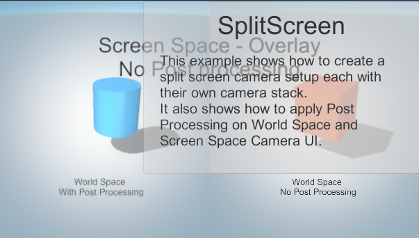

> 이전 포스팅:
> - [[Unity] URP 샘플 패키지 학습 1편 - Camera Stacking : Mixed field of view](https://usbin.github.io/posts/unity_urp-01-camera-stacking/)

---
 

## [샘플 패키지 02] Camera Stacking: 3D skybox

<table style="table-layout: fixed; width: 100%; border: 1px solid gray;">
    <tr>
         <th style="word-wrap: break-word; word-break: break-word; width: 100%;">3D skybox</th>
    </tr>
    <tr>
        <td style="word-wrap: break-word; word-break: break-word; white-space: normal; padding: 10px;"> CameraStacking/3D Skybox 예제는 카메라 스태킹을 사용하여 축소 환경을 스카이박스로 전환합니다. 한 오버레이 카메라는 축소된 도시를 렌더링하고 다른 카메라는 축소된 행성을 렌더링합니다. 오버레이 카메라는 메인 카메라가 그리지 않은 픽셀로 렌더링됩니다. 스크립팅된 추가 이동을 사용하면 축소 환경이 메인 카메라 뷰의 배경에 전체 크기로 표시됩니다.</td>
    </tr>
</table>

이 예제도 Mixed field of view 예제외 비슷한 응용을 보여준다.

월드 공간에 3개의 카메라를 두어 각각 다른 장면을 렌더링하여 최종적으로 하나의 화면에 합쳐서 출력하는 것이다.

(1) 메인 카메라

난간과 UI를 렌더링한다. 오른쪽 이미지는 메인 카메라만 켠 상태의 게임뷰이다.

(2) City 카메라

도시를 렌더링한다. 오른쪽 이미지를 보면 게임뷰에 도시가 더해져서 보인다.

(3) Skybox 카메라

하늘을 렌더링한다. 오른쪽 이미지를 보면 게임뷰에 하늘과 반투명한 행성이 더해져서 보인다.

 
 

월드상에서 난간, 도시, 하늘의 위성은 각각 떨어져있지만 이를 비추는 카메라가 최종적으로 메인 카메라에 Stack됨으로써 하나의 화면에 겹쳐져 보이게 된다.

## [샘플 패키지 03] Camera Stacking: Split screen

<table style="table-layout: fixed; width: 100%; border: 1px solid gray;">
    <tr>
         <th style="word-wrap: break-word; word-break: break-word; width: 100%;">Split screen</th>
    </tr>
    <tr>
        <td style="word-wrap: break-word; word-break: break-word; white-space: normal; padding: 10px;"> CameraStacking/SplitScreenPPUI 예제는 각 화면에 자체 카메라 스택이 있는 분할 화면 카메라 설정을 만드는 방법을 보여줍니다. 또한 월드 공간 및 스크린 공간 카메라 UI에 포스트 프로세싱을 적용하는 방법도 보여줍니다.</td>
    </tr>
</table>

이번 예제는 게임뷰에서 좌우로 분리된 화면을 보여준다.
카메라 스택을 따로 사용하는 카메라 둘을 사용해 화면을 split하는 방법을 제시해주는 것 같다.
동시에 Post Processing을 사용 여부에 따른 결과물 차이도 보여주는 듯하다.

**(1) Base 카메라**
- Base Left 카메라 \
  

  왼쪽 카메라는 View port의 x,y는 (0,0)이고 width는 0.5로 설정되어있다.
- Base Right 카메라 \
  

  오른쪽 카메라는 View port의 x,y는 (0.5, 0)이고 width는 0.5로 설정되어있다.

각각 좌우 반쪽씩을 차지하도록 Viewport에 설정되어있는 것을 확인할 수 있다.

**(2) Overlay 카메라**

<figure style="width:49%; text-align: center; margin:0px; padding:0px;">

<figcaption>Overlay Left 카메라</figcaption>
</figure>
<figure style="width:49%; text-align: center; margin:0px; padding:0px;">

<figcaption>Overlay Right 카메라</figcaption>
</figure>

오버레이 카메라는 왼쪽, 오른쪽 카메라의 차이점이 Post Processing 옵션을 체크했느냐의 여부뿐이다.

**(3) PostProcessingVolume**
색조 효과, Bloom, Panini Projection(지도 투영. 3D 객체를 2D 평면에 나타낼 때 사용하며 필연적으로 왜곡을 만든다.), Chromatic aberration(렌즈 굴절 효과) 등을 설정하는 프로파일 에셋.
Post Processing 항목을 켜면 이 설정값의 영향을 받는다.

## 테스트

왼쪽: Base 카메라만 Post Processing을 켰을 경우와, \
오른쪽: Overlay 카메라만 Poast Processing을 켰을 경우의 비교.

## 결론

- Camera Stacking
  - 카메라의 Render Type이 Base일 경우에만 스택 카메라로 Overlay 카메라를 넣을 수 있다. Overlay 카메라는 1개 이상 설정 가능하다.
  - Base 카메라 위에 Overlay로 설정된 카메라들이 그려진다.
- Post Processing
  - 프로파일 에셋으로 굴절 효과 등의 Post Processing을 설정할 수 있다.
  - 캔버스의 카메라 설정이 Screen Space - Overlay일 경우 Post Processing이 적용되지 않는다.
  - 캔버스의 카메라 설정이 Screen Space - Camera일 경우, 할당된 카메라의 Post Processing 항목의 영향을 받는다.
  - 캔버스의 카메라 설정이 World Space일 경우, 본인이 그려지고 있는 카메라의 Post Processing 항목의 영향을 받는다.(Event Camera가 아님!)
