> 이전 포스팅:
> - [[Unity] URP 샘플 패키지 학습 1편 - Camera Stacking : Mixed field of view](https://usbin.github.io/posts/unity_urp-01-camera-stacking/)
>  - [[Unity] URP 샘플 패키지 학습 2편 - Camera Stacking : 3D skybox, Split screen](https://usbin.github.io/posts/unity_urp-02-camera-stacking/)

---
 

## [샘플패키지 04] Renderer: Ambient Occlusion

<table style="table-layout: fixed; width: 100%; border: 1px solid gray;">
    <tr>
         <th style="word-wrap: break-word; word-break: break-word; width: 100%; white-space: normal; padding: 10px;">엠비언트 오클루젼(Ambient occlusion)</th>
    </tr>
    <tr>
        <td style="word-wrap: break-word; word-break: break-word; white-space: normal; padding: 10px;">인접한 오브젝트 사이를 어둡게 렌더링하는 것을 말함.</td>
    </tr>
</table>

### \<적용 예시\>

<figure style="width:90%; text-align: center; margin:10px; padding:0px;">
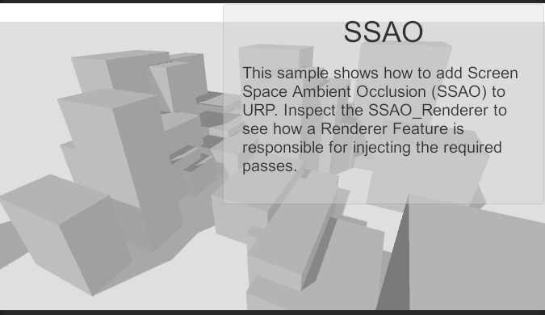
<figcaption>Before</figcaption>
</figure>

<figure style="width:90%; text-align: center; margin:10px; padding:0px;">
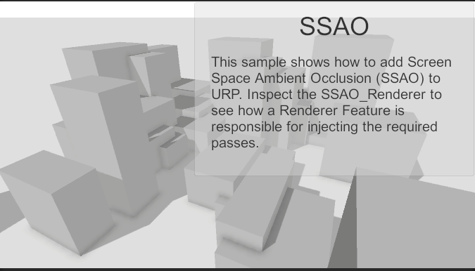
<figcaption>After</figcaption>
</figure>

적용했을 때 좀더 사실적인 렌더링에 가까워보임을 알 수 있음.

### \<적용하는 법\>
URP를 사용하려면 URP Asset을 설정해야 하는데
Edit > Project Settings > Quality > Rendering 아래의 Render Pipeline Asset 항목에 샘플 URP Asset을 넣으면 됨. ([1편 참조](https://usbin.github.io/posts/unity_urp-01-camera-stacking/#1-camera-stacking-mixed-field-of-view))

여기서 샘플 URP Asset을 클릭하면 Inspector에 포함된 렌더러 리스트가 보인다.
여기서 SSAO_Renderer라고 이름붙은 것이 앰비언트 오클루젼 효과를 주는 렌더러이다.

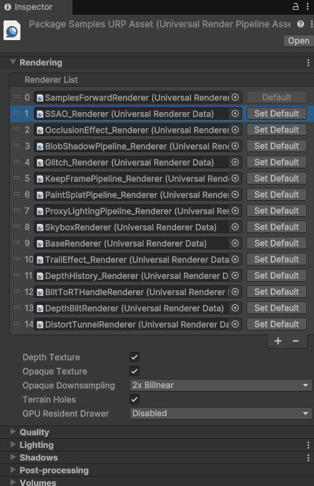

클릭해보면,

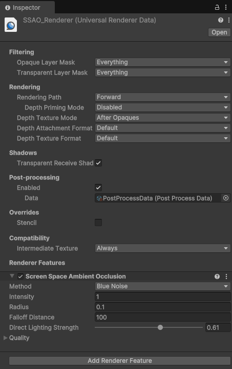

예제 폴더 안에 들어있는 렌더러 파일을 Inspector에서 볼 수 있게 된다.

 

 

 

 

## [샘플패키지 05] Renderer: Glitch effect
글리치 이펙트. 지직거리는 듯한 이펙트를 말한다.

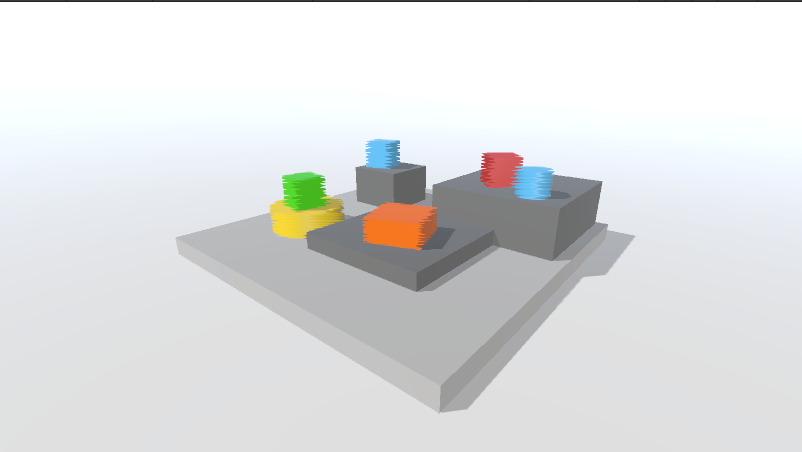

마찬가지로 Glitch Renderer를 샘플 URP Asset의 렌더러 리스트에 추가하면 된다.
위의 사진에서 4번 렌더러로 등록되어 있는 것을 확인할 수 있다.

Glitch Renderer의 Inspector를 확인해보면,
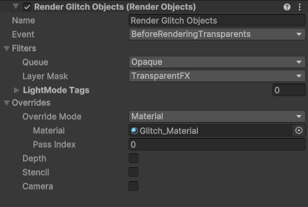

몇가지 설정을 볼 수 있다.

Event 드롭다운은 언제 이 효과를 적용하는지 시점을 설정하는 것 같다.
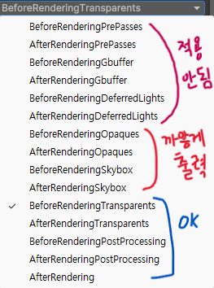

이것으로 화면의 렌더링 순서를 추정할 수 있다.
PrePasses \> Gbuffer \> DeferredLights \> Opaques(불투명) \> Skybox \> Transparents(투명) \> PostProcessing \> Rendering

기본적으로 화면에 오브젝트를 그릴 때, 불투명 오브젝트 중에서 가장 앞에 오는 것을 먼저 그린 뒤, 투명 오브젝트를 겹겹이 그린다.
그 뒤에 Post Processing을 거치고 최종 Rendering을 거치는 걸 확인할 수 있다.

이 기본적인 단계의 전후에 끼여있는 다른 과정들은 아직 뭔지 모르겠다.

렌더링 순서를 테스트해보니, BeforeRenderingOpaques까지는 효과가 적용되지 않고, AfterRenderingOpaques부터 AfterRenderingSkybox까지는 오브젝트들이 새까맣게 출력되며, BeforeRenderingTransparents부터는 효과가 잘 적용된다.

> 의문점 1. 글리치 오브젝트들은 Opaque(불투명)이기 때문에 Opaque 렌더 전에 효과를 적용하면 그냥 무시되는 것 같다. 하지만 그 아래 항목에서 까맣게 출력되는 이유는 모르겠음.

> 의문점 2. 현재 글리치 렌더러의 Queue는 Opaque로 설정되어 있다. Opaque 오브젝트에만 적용한다는 것 같다. 글리치 오브젝트들 또한 Opaque(불투명)이다. 그렇다면 일부를 투명 오브젝트로 변경한 후 글리치 렌더러의 Queue를 Transparent로 변경하면 투명 오브젝트에만 효과가 들어갈까?

화면 뒤쪽에 있는 빨간색 큐브에 테스트해보자.

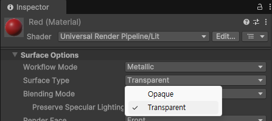

큐브에 할당된 Material의 Surface Type을 Opaque \> Transparent로 변경하고,

글리치 효과가 사라진 걸 확인한다.

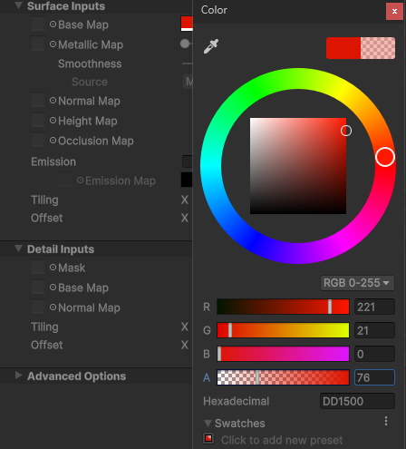

그리고 아래 Surface의 투명도를 조절한 뒤,

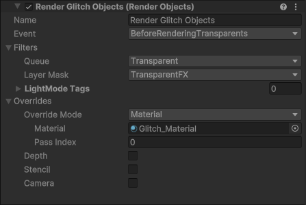

글리치 렌더러의 Queue를 Opaque \> Transparent로 변경하면,

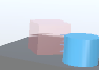

글리치 효과가 들어가있다!

다만 큐브에 들어갔다기보단 큐브 뒤의 물체가 글리치 효과를 얻은 것 같다...

여기서 글리치 렌더러의 Event를 AfterRenderingTransparents로 변경하면,

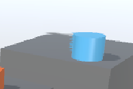

큐브가 보이지 않게 되고 글리치 효과만 남는다.
오히려 이게 제대로 적용된 느낌이다.

오브젝트 자체가 Transparents라서 글리치가 덮는 건지...
아무튼

### 결론

글리치 렌더러는 Opaque 오브젝트에 적용할 경우 이벤트 시점을 최소한 Before Transparents 또는 그 뒤로 설정해야 하고,

Transparent 오브젝트에 적용할 경우 이벤트 시점을 Before Transparents(해당 오브젝트의 본래 형태를 유지할 경우) 또는 After Transparents나 그 이후(해당 오브젝트는 없어지고 글리치 투과 효과만 남길 경우)로 설정해야 한다.

 
 
 
 

## [샘플 패키지 06] Renderer: Keep frame

커스텀 렌더러를 사용할 때, 이전 프레임을 저장해두고 다음 프레임을 그리기 위한 정보로 사용하는 기능인 듯함.

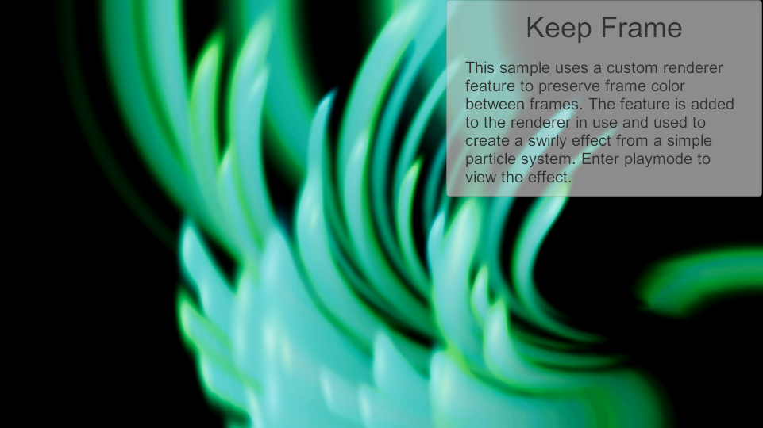

뭘 위한 기능인지는 알겠는데, 어디에 활용할 수 있는지는 모르겠음...

커스텀 렌더러를 직접 정의해서 이동 경로를 계산할 때 쓸 정도로 깊게 응용할 때나 유용할듯.
