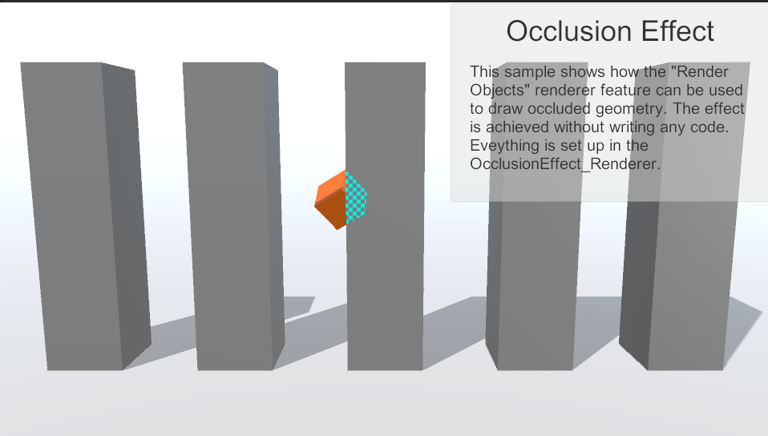
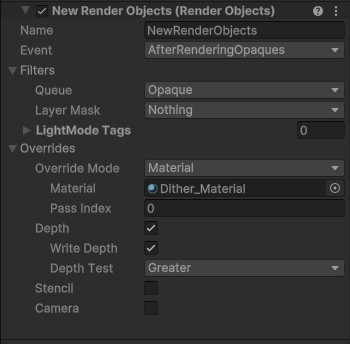
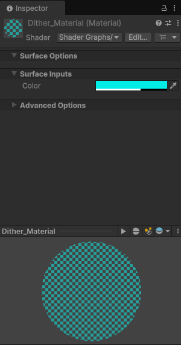
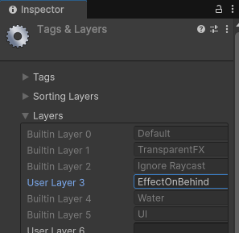
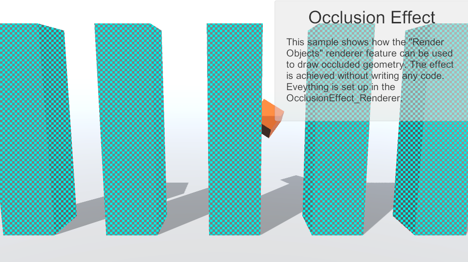
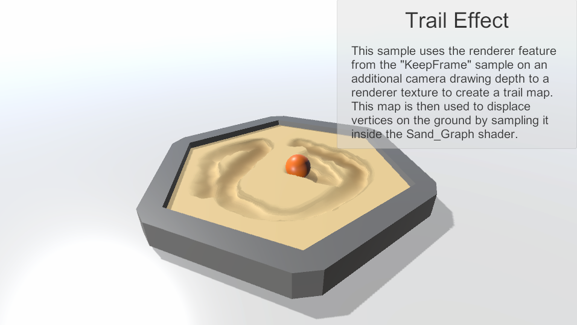
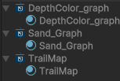





> 이전 포스팅:
> - [{{post1.title}}]({{post1.url}})
> - [{{post2.title}}]({{post2.url}})
> - [{{post3.title}}]({{post3.url}})

---
 

## [샘플 패키지 07] Renderer: Occlusion effect

오브젝트 뒤에 가려진 일부만 특수하게 연출하는 효과.

URP Package Samples 폴더 \> Renderer Features \> OcclusionEffect \> OcclusionEffect_Renderer의 Inspector.

Script의 이름은 Render Objects이다. SSAO처럼 따로 스크립트가 존재하지 않고 그냥 공통된 script를 사용하고 있다.  
그렇다면 설정값과 Material만으로 저런 효과를 만들었다는 뜻이다.  
참고로 Glitch Renderer도 Render Objects를 사용한다. 대신 그쪽은 Glitch graph라는 걸 설정해서 복잡한 글리치 효과를 구현해놨다.  

> 일단 Render Objects의 설정을 보자. 

1. Depth 테스트가 Greater로 설정되어 있다.  
Depth 버퍼는 "카메라에 맨 앞에 비춰지는 오브젝트의 깊이"이다. Greater로 설정되었다면 카메라에 가려지는지를 체크한다는 뜻이다.

2. Override Material이 Dither이라는 이름의 Material로 설정되어있다.  

    

    이렇게 생긴 메테리얼이다. 겹친 부분에 덮어씌울 메테리얼을 설정한다.

3. Queue는 Opaque, Layer Mask는 Nothing  
Layer Mask는 Moving Cube와 같은 레이어로 되어있어야 할 텐데 Nothing으로 되어있었다.  
MovingCube의 Layer는 비어있다...  
Play 누르면 잘 돌아가긴 하는데 뭐 하나 수정하면 그때부터 안 된다.  
그래서 그냥 Layer를 하나 만들어줬다.  

    

    EffectOnBehind라는 이름으로 만들고, MovingCube의 레이어로 설정한다.  

    그리고 Opaque Effect Renderer의 Layer Mask를 EffectOnBehind로 설정한다.

그럼 이제 **Layer가 EffectOnBehind인 오브젝트**에 대하여, 화면에 가려지는 부분에 한해서, Dither Material을 덧씌우게 된다.

(그 외: Write Depth는 기존의 깊이 값을 덮어써서 기록할지 설정하는 거라는데, 오브젝트와 겹쳤을 때 덧그려진 효과 자체의 깊이 값을 저장하는 것 같다.  
체크를 해제하든 하지 않든 눈에 띄는 변화는 없다.  
비교될 다른 오브젝트가 있어야 할듯.)

### 테스트

반대로 화면 맨 앞에 오는 오브젝트에 대해서만 땡땡이 효과를 넣는 방법은?  

Tower들의 Layer를 EffectOnBehind로 설정하고, MovingCube의 Layer는 Default로 바꾼다.  
그리고 Opaque Effect Renderer의 Depth Test를 Equal로 설정하면 끝.  

Less가 아니라 Equal인 이유는 깊이 버퍼보다 앞에 오는지 체크하는 건 불가능하기 때문이다. 깊이 버퍼라는 게 가장 앞에 오는 오브젝트의 깊이값이기 때문이다. 그래서 맨 앞에 오는 오브젝트는 깊이 버퍼와 Equal인 상태이다. 그보다 작아질 수는 없다.

 
 
 
 

## [샘플 패키지 08] Renderer: Trail effect

이런 식으로 오브젝트의 궤적을 그리는 효과인 것 같다.

단순하게 샤샤샥 효과를 떠올렸는데 그보다 응용된 버전의 예제가 들어있었다.

여기선 Keep Frame Renderer도 사용한다. 이전에 밟고 지나간 좌표를 기억해서 다음 프레임을 그리는 데 사용해야 하기 때문이다.

### \<모래에 궤적이 남는 로직 실행 순서\>

(1) TrailCam은 11:DepthHistory_Renderer를 렌더러로 사용하여 TrailMap 텍스쳐에 출력한다.  
- 11:DepthHistory_Renderer에 설정된 커스텀 쉐이더 DepthColor_graph에는 이전 프레임을 저장하여 input으로 사용하고, output으로 DepthNormal(Material)을 생성하는 HLSL 코드가 들어가있다.
- DepthNormal에는 누적된 궤적이 기록되고 있다.
- TrailCam의 Override Material로 DepthNormal이 설정되어 있다.
- 최종적으로 TrailCam은 누적된 궤적을 TrailMap 텍스쳐에 출력한다.

(2) Main Camera는 10:TrailEffect_Renderer를 렌더러로 사용하여 화면에 출력한다. 
- Sand(Material)의 Surface Texture로 TrailMap이 설정되어 있다.
- 모래의 표면에 누적된 궤적이 반영된 상태로 Display1(화면)에 출력된다.

각 카메라와 렌더러 안에서 일어나는 일들을 정리를 해보았다.

아마도 이전 프레임에서 Sphere의 경로를 누적해서 해당 경로만 빈 상태의 3D Material을 만들어 DepthNormal에 저장하는 로직은 Shader 안에서 연결되어있을 것 같다.  

각각 쉐이더와 연결된 메테리얼 관계를 보면

> DepthColor_graph(Shader) -\> DepthNormal(Material),  
Sand_Graph(Shader) -\> Sand(Material),  
TrailMap(Shader) -\> TrailMapDisplay(Material)  

이렇게 연결되어 있는데

HLSL 문법을 몰라서 도무지 무슨 동작을 하는지 파악할 수가 없다...

그런고로 이번 예제는 여기서 마무리...