




> 이전 포스팅:
> - [{{post1.title}}]({{post1.url}})
> - [{{post2.title}}]({{post2.url}})
> - [{{post3.title}}]({{post3.url}})
> - [{{post4.title}}]({{post4.url}})

---
 

## [샘플 패키지 09] Lens Flares : Sun flare

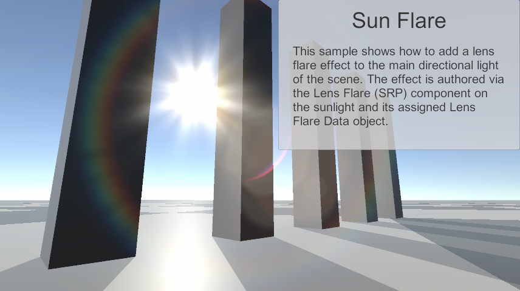

썬 플레어. 태양을 바라볼 때 링 모양의 빛번짐 효과를 준다.

Hierarchy뷰를 살펴보자.

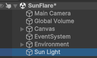

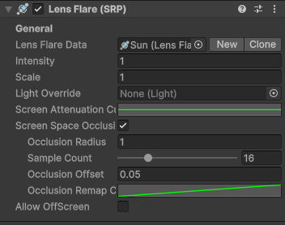

Sun Light 오브젝트에 Lens Flare 스크립트가 붙어있다. 물론 Light도 붙어있긴 한데, Directional로 붙어있는 것 말고 특이점은 보이지 않는다.

Lens Flare Data에 Sun이라는 이름의 에셋이 할당되어 있는데,

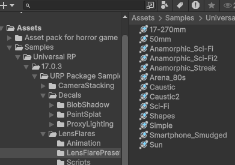

프리셋으로 Sun 외에도 여러 렌즈 플레어가 준비되어 있다. 유용해보인다.

예제 학습이 끝나고 개발에 들어가면 샘플 폴더를 삭제할 생각이었는데 프리셋은 꺼내고 삭제해야겠다.

아무튼, Sun 말고 다른 것을 껴보면 모양이 바뀌지 않을까? 테스트해보자.

> 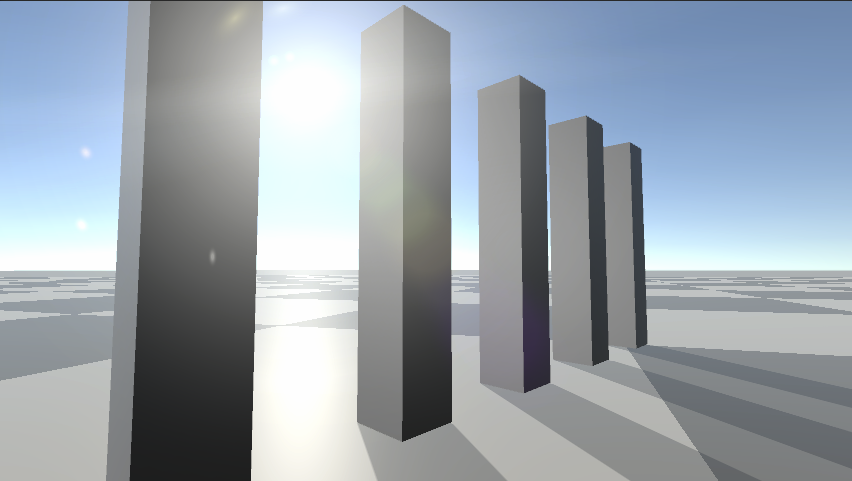
> 17-270mm

 

> 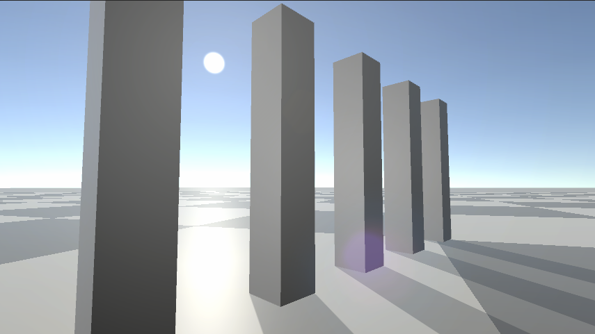
> 50mm
> 중앙 빛번짐 크기의 지름이 작아질 줄 알았는데, 그냥 중앙 빛번짐이 사라졌다. 전체적으로 뿌연 효과는 남은듯.

 

> 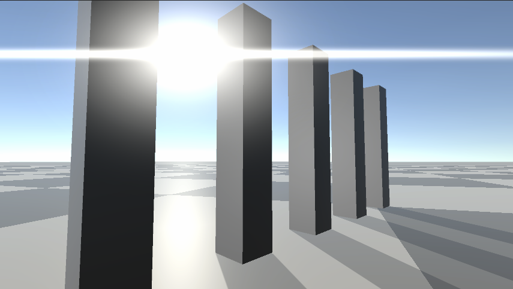
> Anamorphic_Sci-Fi

 

> 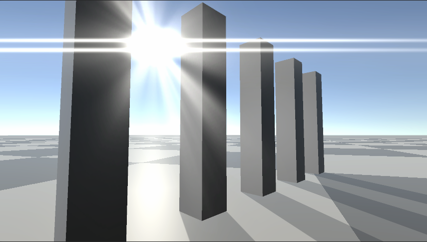
> Anamorphic_Sci-Fi2

 

> 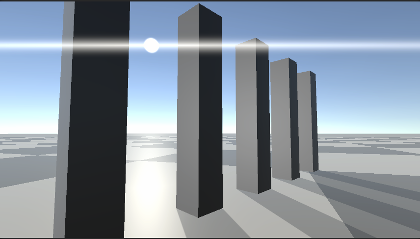
> Anamorphic_Streak

 

> 💬 이쯤되니 Anamorphic의 뜻이 궁금해져 찾아봤다.  
영상 분야에서 사용되는 용어인데, 원뜻은 "왜곡된, 일그러진, 변형된"이란 뜻이지만 업계에선 일반적으로 '와이드스크린 비율을 만들기 위해 특수렌즈를 사용하여 가로로 압축하여 촬영하고, 재생할 때 다시 늘리는 방식'을 뜻한다고 한다. 가로로 길게 늘어지는 독특한 플레어가 특징이라고 한다.  
한마디로 가로로 늘어지는 플레어 라고 보면 되겠다.  

 

> 그 외 렌즈 플레어들...

<figure style="width:49%; text-align: center; margin:0px; padding:0px;">
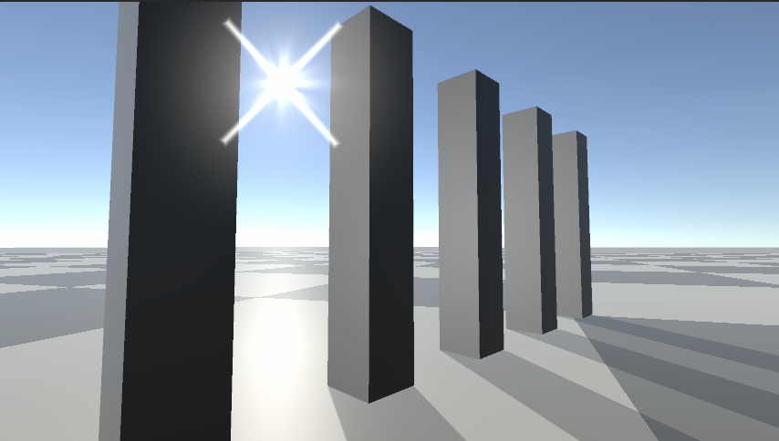
<figcaption>Arena_80s</figcaption>
</figure>
<figure style="width:49%; text-align: center; margin:0px; padding:0px;">
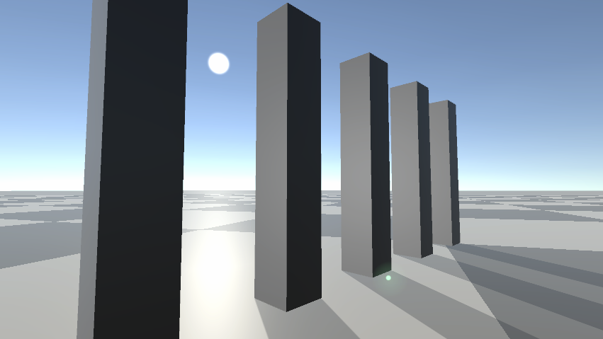
<figcaption>Caustic. 이상한 지점에 반딧불이처럼 생긴다.</figcaption>
</figure>

<figure style="width:49%; text-align: center; margin:0px; padding:0px;">
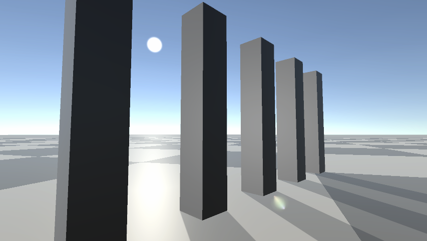
<figcaption>Caustic2</figcaption>
</figure>
<figure style="width:49%; text-align: center; margin:0px; padding:0px;">
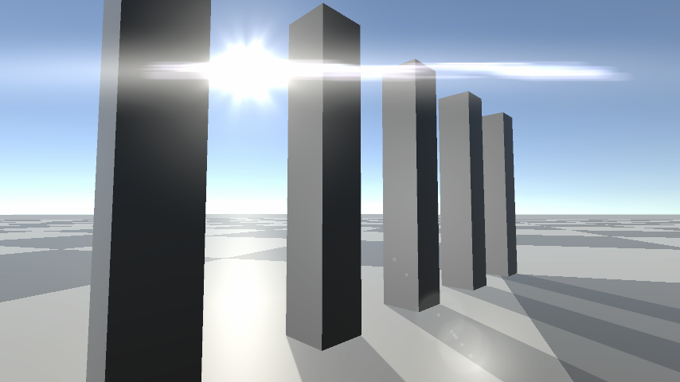
<figcaption>Sci-Fi</figcaption>
</figure>

<figure style="width:49%; text-align: center; margin:0px; padding:0px;">
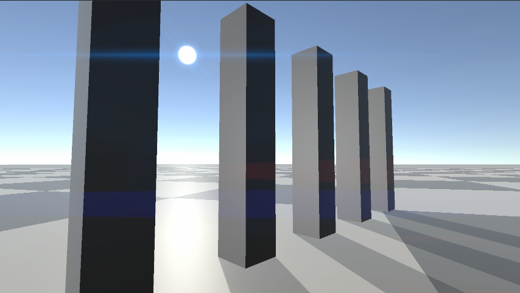
<figcaption>Shapes</figcaption>
</figure>
<figure style="width:49%; text-align: center; margin:0px; padding:0px;">
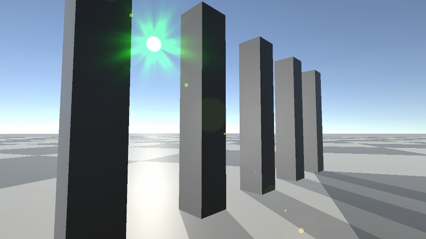
<figcaption>Simple</figcaption>
</figure>

<figure style="width:49%; text-align: center; margin:0px; padding:0px;">
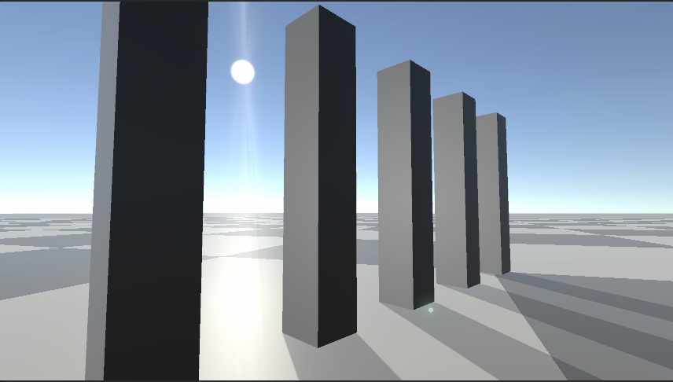
<figcaption>Smartphone_Smudged(스마트폰 화면에 지문이 묻은 상태. 또는 화면이 흐릿하게 더러워진 상태)</figcaption>
</figure>

> 다른 옵션들

- Intensity: 플레어의 강도.
- Scale: 플레어의 크기(결과물은 강도를 올렸을 때와 유사하지만, 강도는 같은 자리에서 강해지고, 이 옵션은 실제로 플레어의 전체 scale이 커짐.)
- Screen Attenuation Curve: 화면 가장자리에 가까울수록 플레어의 강도 변화 Curve 그래프
- Screen Space Occlusion
  - Occlusion Radius: Occlusion에 사용되는 반지름을 정의함. 값이 클수록 Occlusion의 영향을 받는 범위가 커짐.
  - Sample Count: Occlusion Radius내에서 Occlusion 효과에 사용되는 랜덤 샘플 개수. 값이 클수록 Occlusion 효과가 정교하고 낮을수록 효과가 떨어진다. (반지름 내 랜덤 좌표를 뽑아 Occlusion을 계산하는 듯하다. 기본값인 16 전후로 변경해보면 약간의 보정이 더해지거나 줄어들지만, 기본값에서 크게 멀어질수록 차이가 극도로 줄어들기 때문에 기본값에서 건드릴 필요는 없을듯.)
  - Occlusion Offset: Occlusion이 작용하는 범위 offset(단위 m). 값이 높을수록 카메라에 가까운 물체만 Occlusion의 영향을 받고, 값이 작을수록 렌즈 플레어 본체에 가까운 물체들도 영향을 받는다. (렌즈 플레어 ---(offset)--\> 카메라일 때, offset에서 카메라까지 사이의 물체만 영향을 받는 것)
  - Occlusion Remap Curve: 플레어 Occlusion 효과의 Curve 그래프. 기본값은 0에서 1까지 linear 그래프.
- Allow OffScreen: 플레어가 카메라 밖에 있어도 씬에 영향을 주는가?

여기서 Screen Space Occlusion이 잘 이해가 되지 않아 몇가지 테스트를 해봤다.

> Occlusion Radius는 정확히 무엇인가?

Occlusion Radius의 기본값은 1(단위 m)인데, 이때는 광원 부분이 기둥에 가려지면 플레어 효과가 완전히 사라진다.  

값을 0.1~10까지 변경해보았다.

> 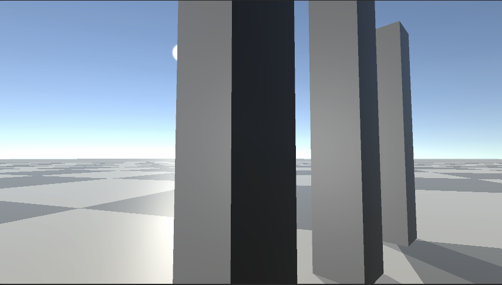
> 0.1일 경우. 일부만 가려져도 플레어 효과가 사라진다.

> 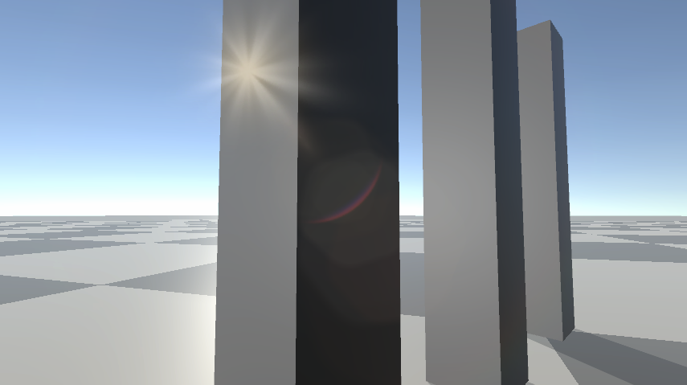
> 2일 경우. 완전히 가려져도 플레어 효과가 남아있다. 하지만 기둥의 정가운데까지 이동시켜보면 역시 사라진다.

3 이상의 값은 기둥에 완전히 가려져도 약간 약해지는 효과만 있을 뿐 플레어 효과가 아예 사라지질 않는다.

그런데 아예 큰 값 100을 입력하면 기둥에 전혀 가려지지 않아도 플레어 효과가 완전히 없어져버린다.

테스트 결과 Occlusion Radius는 "플레어의 차단 효과가 적용되는 범위가 몇 m인가?"를 설정하는 반지름값으로 보인다.  
말하자면 Occlusion 효과가 계산하는 플레어의 본체 반지름 길이라고 생각하면 될 듯.

- 0.1로 했을 땐 플레어 본체가 반지름 0.1 범위이기 때문에 그 부분만 가려지면 플레어가 사라진다.
- 2로 했을 땐 플레어 본체가 반지름 2 범위에 달하므로 지름 4m 전체가 가려져야만 플레어가 사라진다. 그래서 눈에 보이는 플레어가 가려져도 아직 지름 4m 범위가 다 가려진 건 아니기 때문에 플레어 효과가 약하게 남는다.
- 3으로 했을 땐 플레어 본체가 반지름 3 범위에 달하므로 기둥 사이 공간보다 플레어 본체가 더 커진다. 그래서 플레어가 기둥에 완전히 가려지지 않는다.
- 100으로 했을 땐 플레어 본체가 화면 밖으로 나갈 정도로 커져버린다. 그래서 가려지는 부분이 월등히 커지므로, 사실상 대부분이 가려진 상태가 되어 계산 결과 플레어 효과가 없는 것처럼 보인다.  
  ❇️참고로, 이 상태에서 Allow Offscreen을 켜면 플레어 효과가 100% 적용된다. 이 경우 카메라 밖으로 나간 부분이 가려진 것으로 계산되지 않아서 실제 오브젝트에 가려져야만 Occlusion이 들어가는듯. 

 
 
 
 

## [샘플 패키지 10] Lens Flares : Lens flare showroom

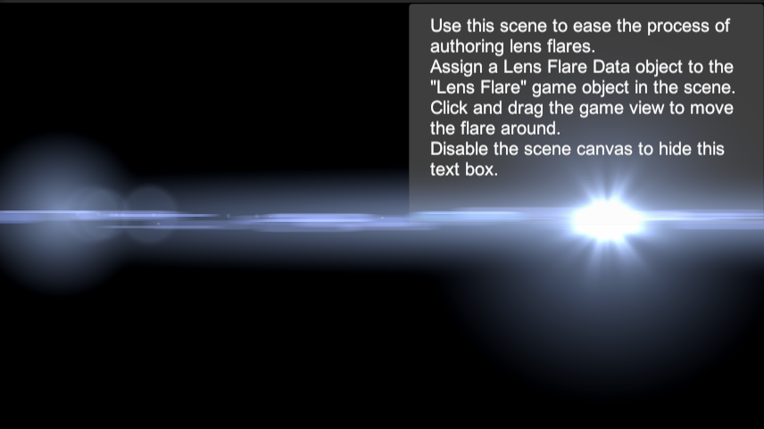

렌즈 플레어 효과를 테스트할 수 있는 쇼룸 씬인 것 같다.

이전 예제와 달리 광원이 Point로 되어 있다.

이 경우, Lens Flare 스크립트에서 한가지 옵션이 활성화되는데,

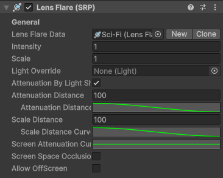

Attenuation이란 이름이 붙은 옵션들이다.

Attenuation: 조명 감쇠 효과. 빛의 세기가 거리나 방향에 따라 점차 감소하는 것.

- Attenuation By Light Shape: 빛의 모양에 따라 렌즈 플레어의 감쇠 모양도 반영된다.
- Attenuation Distance: 거리 감쇠의 거리와 Curve 값을 설정한다.
- Scale Distance: 스케일 감쇠의 거리와 Curve값을 설정한다.
- Screen Attenuation Curve: 화면의 가장자리에 가까울수록 감쇠가 반영되는 Curve값을 설정한다.

여러가지 렌즈 플레어를 설정해서 테스트해볼 수 있다.

***Directional 광원***은 점에서 뻗어나오는 게 아니라 일정 방향에서 균일하게 뻗어나오는 광원이라 실재하는 광원에서 발생한 플레어보다는 그냥 화면에 인위적으로 적용한 플레어 효과에 가깝다. 그래서 광원의 모양이 존재하지 않고, 광원과 거리가 가까워지든 멀어지든 플레어 효과는 동일하다. 그냥 그 방향에 광원이 있으면 적용될 뿐.   
근데 ***Point 광원***은 정말로 실제 월드에 배치된 오브젝트에서 플레어가 작용하는 것 같다. 멀어지면 플레어의 세기도 줄어든다. Occlusion offset으로 차단 적용 범위가 변경되는 게 아니라 광원과 거리가 멀어지며 빛의 세기도 줄어드는 것이다. 
