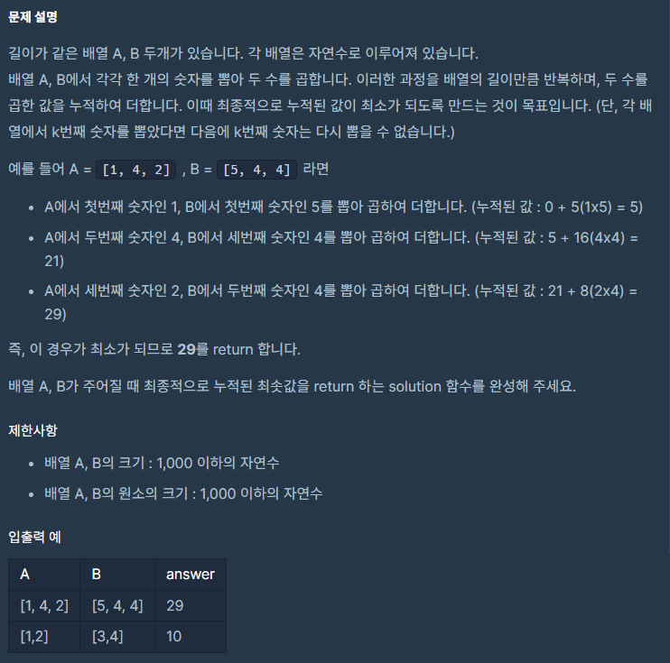

## 접근

이거 가방 알고리즘으로 풀릴 것 같아서
가능하면 가방 알고리즘으로 풀어봤으면 싶은데
그건 나중에 시도해보기로 하고(사유: 가방 알고리즘 까먹음)

일단 직관적으로 생각해보면 단순히 A배열의 가장 작은 값부터 B배열의 가장 큰 값 순서로 곱하기만 해도 답이 나온다.

이제 구현이 문제다.

처음 짰던 코드는 합병정렬을 사용하면서 함수 파라미터로 vector를 넘겨주는 방식이었다.
합병정렬은 까먹어서 구글링을 통해 구현했다.

그런데 이렇게 하면 테스트케이스는 통과하지만 본 제출의 효율성 테스트에서 시간초과가 나더라.

재귀함수 자체가 겹겹이 쌓이는 함수 호출 때문에 오버헤드가 큰(비효율적인) 작업이라고 배웠다.
시간초과도 아마 재귀함수의 오버헤드와 벡터 파라미터 때문인 것 같았다.
왜냐면 합병정렬 시간복잡도는 nlogn이라, 정렬 중 가장 적은 시간을 요구하기 때문이다.
알고리즘 차원에서 이것보다 더 줄이는 건 불가능하다.

그래서 소스코드를 고쳐서 하나의 벡터를 계속 참조로 넘겨주고, start, end 인덱스로 접근하도록 수정하니 통과했다.


## 전체 소스코드

```c++
#include <iostream>
#include <vector>
#include <algorithm>
using namespace std;

void merge(vector<int>& v, int v1_start, int v1_end, int v2_start, int v2_end){
    vector<int> result;
    int i1=v1_start;
    int i2=v2_start;
    while(i1!=v1_end && i2!=v2_end){
        if(v[i1] < v[i2]){
            result.push_back(v[i1]);
            i1++;
        }
        else{
            result.push_back(v[i2]);
            i2++;
        }
    }
    
    while(i1!=v1_end){
        result.push_back(v[i1]);
        i1++;
    }
    while(i2!=v2_end){
        result.push_back(v[i2]);
        i2++;
    }
    for (int i = 0; i < result.size(); i++) {
        v[v1_start + i] = result[i];
    }
}

//
void merge_sort(vector<int>& v, int start, int end){
    
    if(end-start<2) return;
    
    int mid = (start + end)/2;
    
    merge_sort(v, start, mid);
    merge_sort(v, mid, end);
    
    merge(v, start, mid, mid, end);
}

int solution(vector<int> A, vector<int> B)
{
    //가장 작은 수 * 가장 큰 수로 곱하면 될 거 같은데
    merge_sort(A, 0, A.size());
    merge_sort(B, 0, B.size());
    
    int i = 0;
    int j = B.size()-1;
    
    int sum = 0;
    while(i<A.size()){
        sum+= A[i]*B[j];
        i++;
        j--;
    }
    return sum;
        
}
```