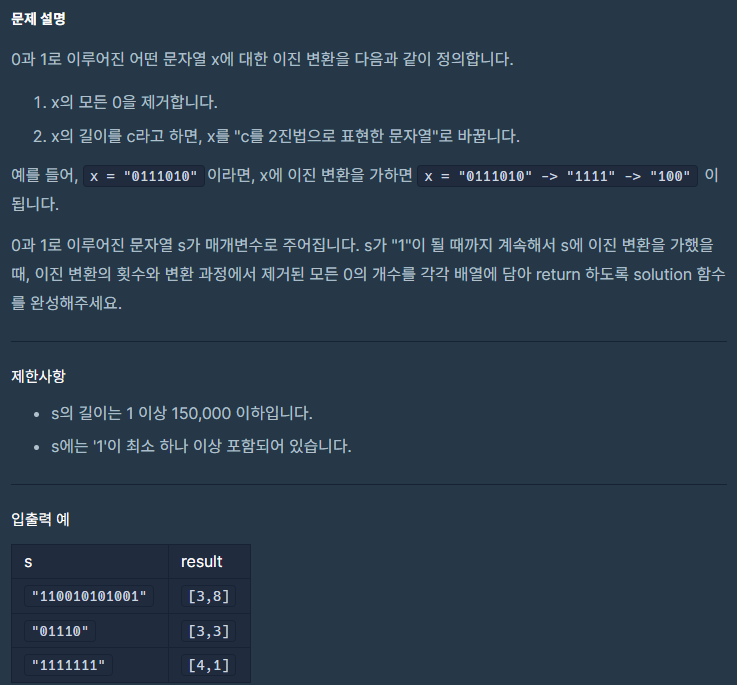

## 접근

난이도 제일 쉬운 것부터 거슬러올라가며 풀고 있기 때문에
이 문제는 쉬운 문제다...

1.0을 제거
2.남은 문자열의 길이를 n이라고 할 때, n을 이진법으로 표현한 문자열로 변환

이 두가지를 구현하고 반복하면 된다.

문제는 2번 구현을
너무
박대갈이 같이 했다는 점이다...

9번 테스트케이스만 계속 통과하지 못해서 CHAT GPT에게 물어봤고
내가 비효율적인 변환 코드를 사용하고 있다는 말을 들었다.


## 처음 짠 소스코드

```c++
#include <string>
#include <vector>

using namespace std;

string BinaryText(int n) {
    string s = "";
    int k = 1;
    k = k << 15;

    bool addZero = false;
    while (k >= 1) {
        if (k > n) {
            if (addZero) s += "0";
        }
        else {
            n -= k;
            s += "1";
            addZero = true;

        }
        k = k >> 1;
    }
    return s;
}
void RemoveZeroAll(string& s, int& count) {
    string result;
    for (int i = 0; i < s.size(); i++) {
        if (s[i] == '0') {
            count++;
            continue;
        }
        result += "1";
    }
    s = result;
}
vector<int> solution(string s) {

    int count = 0;
    int zeroCount = 0;
    while (s != "1") {
        RemoveZeroAll(s, zeroCount);
        s = BinaryText(s.size());
        count++;
    }

    vector<int> answer;
    answer.push_back(count);
    answer.push_back(zeroCount);
    return answer;
}
```


문제는 바로 BinaryText 부분이다.

```c++
string BinaryText(int n) {
    string s = "";
    int k = 1;
    k = k << 15;

    bool addZero = false;
    while (k >= 1) {
        if (k > n) {
            if (addZero) s += "0";
        }
        else {
            n -= k;
            s += "1";
            addZero = true;

        }
        k = k >> 1;
    }
    return s;
}
```

직관적으로 사람이 계산을 하듯 41이라는 값을 예로 들면
41와 같거나 작은 2의 제곱수는 32니까 32를 빼고
9가 되면
9와 같거나 작은 2의 제곱수인 8을 빼고
1이 남으면 1을 빼고

32 (16) 8 (4) (2) 1
1 0 1 0 0 1

이렇게 변환을 하고 있었는데

챗지피티가 코드를 다시 짜줬다.

```c++
string BinaryText(int n){
    string s = "";
    
    while(n > 0){
        s = char('0' + (n%2)) + s;
        n = n>>1;
    }
    
    return s;
}
```
Real 박대갈이. . . ..

n을 오른쪽으로 한 칸씩 밀면서 계산하는 건 같지만 \
s에 왼쪽부터 채우는 게 아니라 오른쪽부터 채우면 코드가 간결해진다는 것을 몰랐다...

s = char('0' + (n%2)) + s; 라니 \
이 얼마나 아름다운 코드인가.

보고도 한참을 생각해서 "아 !" 깨달았다. \
자괴감이 든다.

갈 길이 멀다.

자주 쓰는 기교든 잘 안 쓰는 기교든 나는 정말 통으로 외우고 다녀야 살아남을 수 있겠다. \
코딩 센스란 멀고 어렵고 닿기 어려운 것이다.