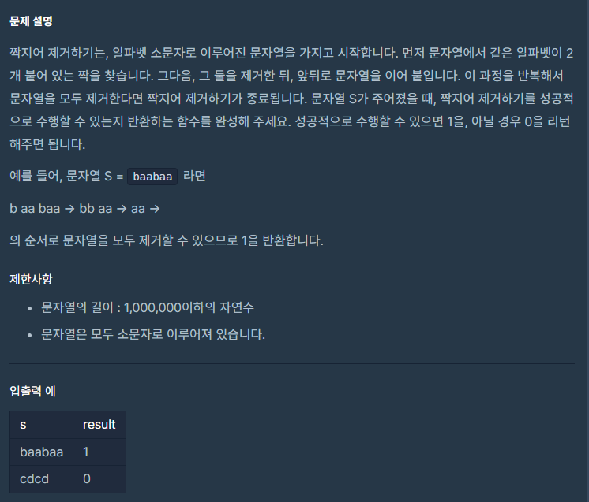

## 접근

이것 또한 센스 문제다. \
또 빡대갈이 같이 풀고 말았다...

처음에 단순무식하게 앞에서부터 매번 새로 읽어가며 같은 게 있는지 찾고 \
있으면 제거하고, 없으면 while을 빠져나와서 \
결과적으로 ""이 남았으면 1을 리턴, 아니면 0을 리턴하도록 했다.

이렇게 했더니 한 3번 문제부터는 500ms가 나더라.
효율성 문제는 당연히 시간 초과...

CHAT GPT에게 물어봐서 답을 찾았다.


```c++
#include <iostream>
#include<string>
#include <stack>
using namespace std;


int solution(string s)
{
    stack<char> st;
    for(char c:s){
        if(!st.empty() && st.top() == c){
            st.pop();
        }
        else{
            st.push(c);
        }
    }
    
    return st.empty() ? 1 : 0;
    
    
}
```
레알로 아름다운 코드다.

괄호 열고 닫기와 같은 원리라는 걸 몰랐다.

알았어도 이렇게 깔끔하게 풀진 못했을 거 같긴 함.

스택 풀이를 쓸 수 있는 케이스를 머리에 새겨두자...

같은 것이 배열의 특정 지점에서부터 좌우로 쌍을 이루는 구조면, 스택으로 벗겨나가는 것이 좋다 !