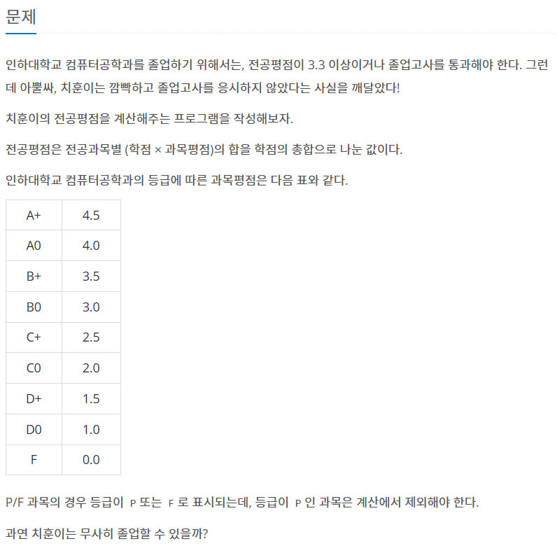
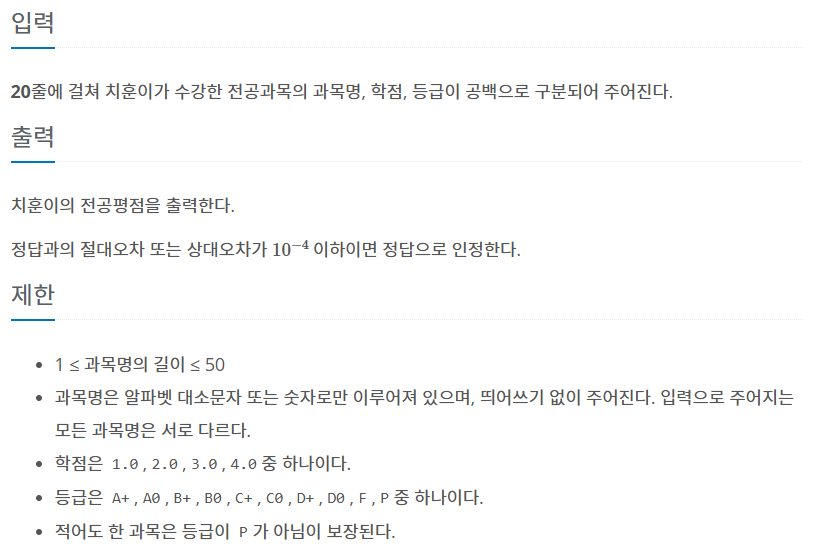

코테 연습 사이트를 다시 백준으로 옮겼다.

백준이 더 어려운 것 같다...




```c++
//예제 입력1
ObjectOrientedProgramming1 3.0 A+
IntroductiontoComputerEngineering 3.0 A+
ObjectOrientedProgramming2 3.0 A0
CreativeComputerEngineeringDesign 3.0 A+
AssemblyLanguage 3.0 A+
InternetProgramming 3.0 B0
ApplicationProgramminginJava 3.0 A0
SystemProgramming 3.0 B0
OperatingSystem 3.0 B0
WirelessCommunicationsandNetworking 3.0 C+
LogicCircuits 3.0 B0
DataStructure 4.0 A+
MicroprocessorApplication 3.0 B+
EmbeddedSoftware 3.0 C0
ComputerSecurity 3.0 D+
Database 3.0 C+
Algorithm 3.0 B0
CapstoneDesigninCSE 3.0 B+
CompilerDesign 3.0 D0
ProblemSolving 4.0 P

//예제 출력1
3.284483
```


## 접근

> 필요스킬
> 1. 한 줄 문자열 입력
> 2. 문자열 분리하기

```c++
#include <sstream> //string stream을 선언해준다.

using namespace std;
int main(){

    //1. 한 줄 문자열 입력

    string rawLineString;
    getline(cin, rawLineString);    //기본적으로 line 단위로 읽는다.


    //2. 문자열 분리하기
    istringstream iss(rawLineString);
    string strA, strB, strC;
    getline(iss, strA, ' ');        //delimeter를 지정해서 읽는다.
    getline(iss, strB, ' ');
    getline(iss, strC);             //마지막은 line으로 끝날 테니 delimeter 기본값으로.

}
```

## 소스코드
```c++
#include <iostream>
#include <string>
#include <sstream>
using namespace std;
float ConvertScore(string str) {
    if (str == "A+") return 4.5f;
    else if (str == "A0") return 4;
    else if (str == "B+") return 3.5f;
    else if (str == "B0") return 3;
    else if (str == "C+") return 2.5f;
    else if (str == "C0") return 2;
    else if (str == "D+") return 1.5f;
    else if (str == "D0") return 1;
    else if (str == "F") return 0;

    return 0;
}
int main() {
    int classPointSum = 0;
    float sum = 0;

    int cnt = 0;
    string rawInput;

    

    for (int i = 0; i < 20; i++) {
        getline(cin, rawInput);

        string tmp;
        string rawClassPoint;
        string rawScore;

        istringstream iss(rawInput);
        getline(iss, tmp, ' ');
        getline(iss, rawClassPoint, ' ');
        getline(iss, rawScore);
       

        if (rawScore == "P") continue;
        int classPoint = stof(rawClassPoint);
        cnt++;
        classPointSum += classPoint;
        sum += ConvertScore(rawScore) * classPoint;

        
    }
    cout << sum / classPointSum;

}
```

---

>[!NOTE]
> 백준에서 입력을 받을 때, 입력 횟수가 정해져있을 때도 있고 정해져있지 않을 때도 있다.\
> 정해져있지 않을 경우, "입력 종료"를 어떻게 판별해야 할까?
> 
> 보통 eof(파일의 끝)을 만났는가? 또는 stream이 FALSE가 되었는가? 둘 중 하나의 조건으로 종료를 체크한다.

```c++
//eof로 체크하기(권장되지 않음!)
while(cin.eof())

//stream으로 체크하기
while(cin>>myString)
while(getline(cin, myString))
```

문제는, 백준에서 제공하는 문자열의 끝이 엔터+EOF일 수도 있고 그냥 엔터일 수도 있다는 것이다.

> 1.EOF(End Of File)의 TRUE를 체크하기(권장되지 않음!)

엔터+EOF로 붙어 올 경우엔 cin.eof()로 체크하는 것이 문제가 되지 않지만, \
EOF가 붙어오지 않을 경우 cin.eof()는 읽기를 "실패"했을 때 TRUE로 저장된다.

while문 같은 경우엔 [eof 조건 확인]->[본문 안에서 읽기 시도] 순서로 이루어질 텐데, \
이 경우 한 번 더 돌아간 다음 그 다음 번 조건 체크에서 루프를 탈출한다.

그러니 eof가 만드시 붙어 온다고 명시된 경우가 아니면 cin.eof()는 그냥 쓰지 말자.


> **2.stream의 FALSE 여부를 체크하기**

stream으로 체크하는 것은 읽기에 실패할 때 FALSE가 되기 때문에, \
while문 안에서 읽기를 시도하는 구문까지 꼭 함께 넣어줘야 한다.

```while(cin)``` 이렇게 쓰면 안 된다는 점을 명심하자.
