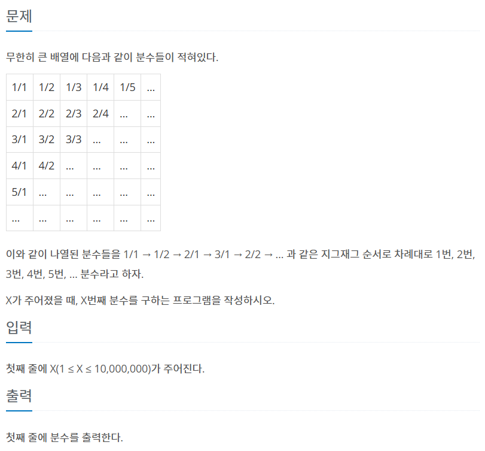

```
//예제 입력 1
1

//예제 출력 1
1/1
```

```
//예제 입력 2
2

//예제 출력 2
1/2
```

몇 번 풀었던 문제인데 한 번 더 풀어봤다.

```c++
#include <iostream>
using namespace std;
// x행의 분자 값은 x이다.
// y열의 분모 값은 y이다.
// x행y열의 값은 x/y이다.
// 홀수line은 y가 증가하는 방향으로 진행된다.
// 짝수line은 y가 감소하는 방향으로 진행된다.
// k를 1부터 증가시켜가며 X에서 빼는데,
// X가 0 또는 음수가 되기 바로 직전까지만 뺀다.
// X가 0이 된다면 마지막 line의 k번째에 멈추는 거고,
// 음수가 된다면 마지막 line의 k-X+1에서 멈춘 것이다.
// 멈춘 다음 line이 홀수면 (k-X+1/X) 이고,
// 짝수면 X/(k-X+1)이다.
int main(){
    int X;
    cin>>X;
    
    int k=0;
    while(X-(++k)>0){
        X-=k;
    }
    
    if(k%2!=0){
        cout<< (k-X)+1<<"/"<<(X);
        
    }
    else{
        cout<< (X)<<"/"<<(k-X)+1;
    }

    
    
}
```

3번 틀리고 맞히긴 했지만\
예전 풀이를 찾아보지 않고도 예전보다 깔끔하게 풀려서 기분이 좋다.